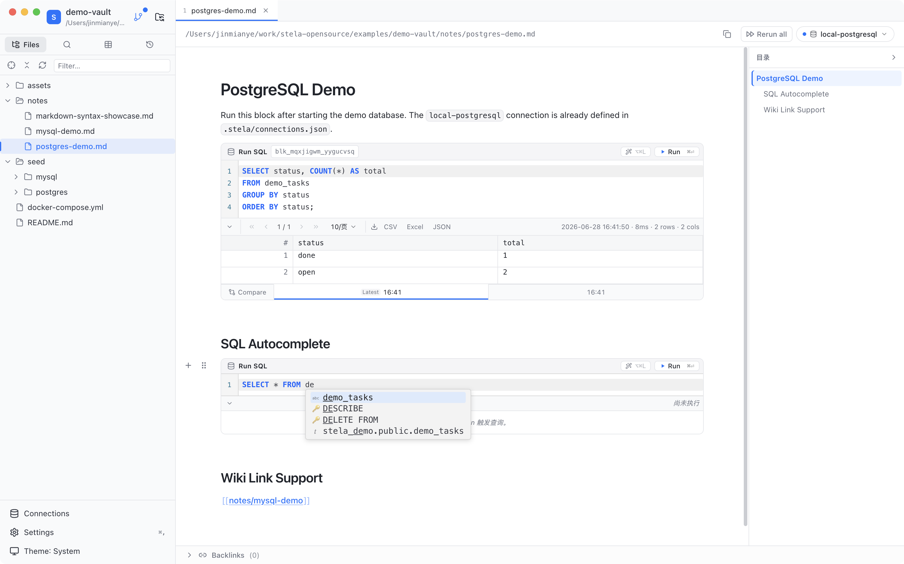
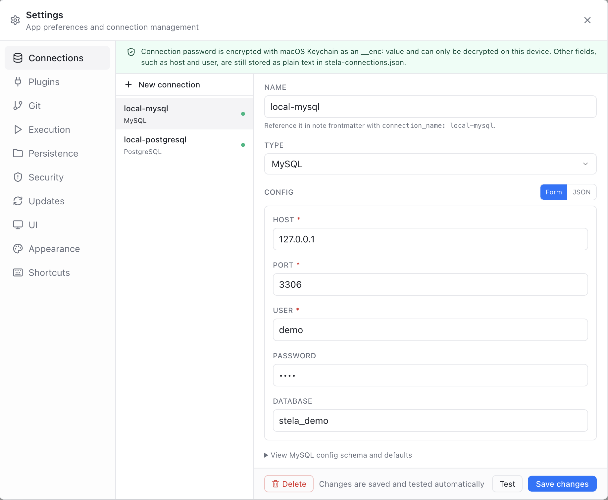
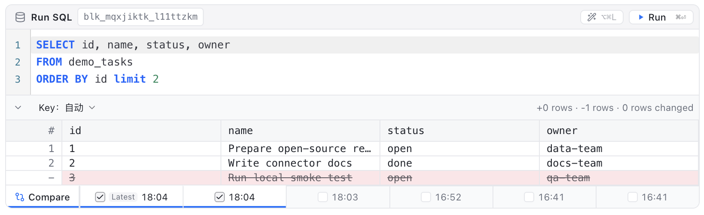
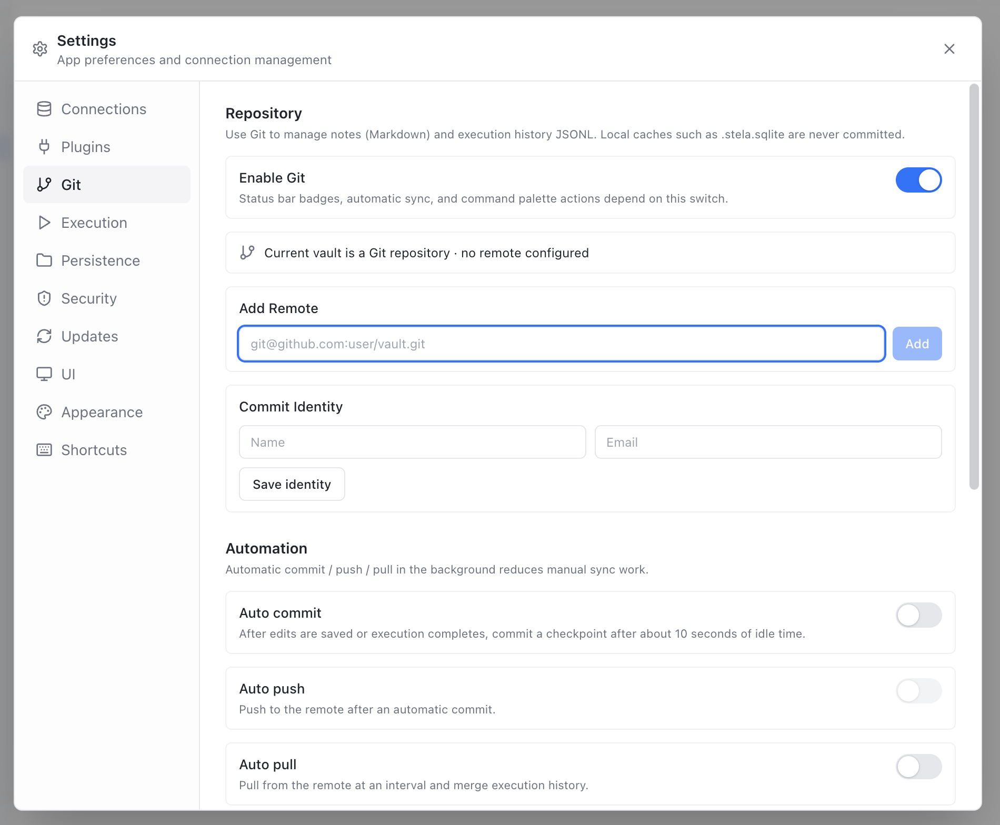
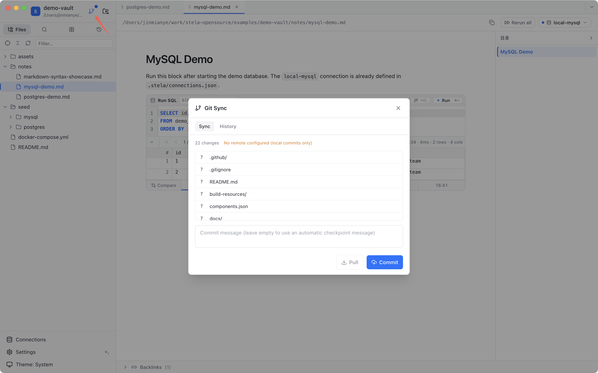
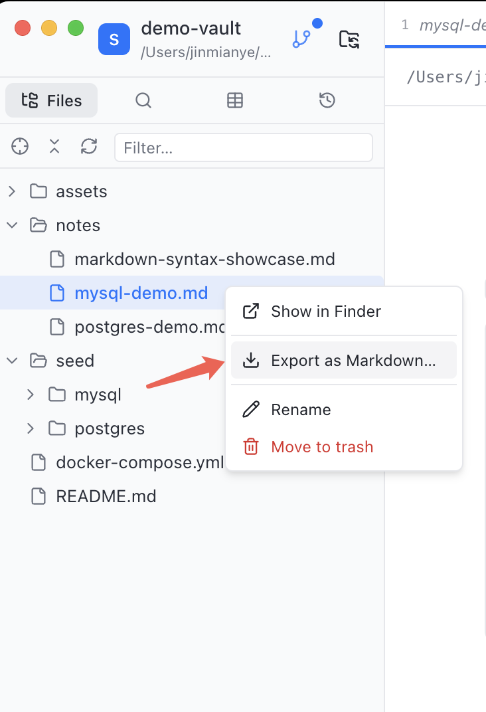
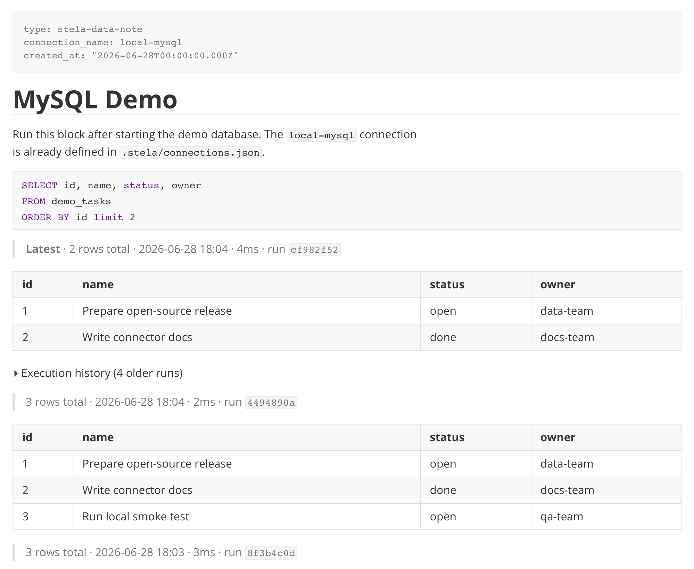

<p align="center">
  
</p>

<h1 align="center">Stela</h1>

<p align="center">
  <strong>Run SQL in Markdown. Track data in Stela.</strong>
</p>

<p align="center">
  <a href="#english">English</a> · <a href="#中文">中文</a> · <a href="#screenshots--产品截图">Screenshots</a>
</p>

## English

Stela is a local-first desktop app for data notes. It lets you write Markdown, run SQL where the data question appears, keep every execution traceable, and turn a folder of notes into a lightweight data workspace.

### Core Features

1. **Run SQL in Markdown**  
   Use `runsql` blocks inside normal Markdown files. A note can mix prose, assumptions, query context, and executable SQL in one place.

2. **Connect to Multiple Databases**  
   Stela connects to databases through connector plugins. The open-source version includes bundled connectors for MySQL and PostgreSQL, plus a generic HTTP gateway sample for custom data backends.

3. **Execution History and Result Diff**  
   Every run is recorded. You can revisit previous executions, inspect result metadata, compare result changes over time, and keep failed runs visible for debugging.

4. **Git Sync and History Management**  
   Stela is built around a Git-friendly vault model. Notes stay as plain `.md` files, while execution history is stored as append-only JSONL under `.stela/history/`.

5. **Markdown Compatibility and Data Export**  
   Stela notes remain standard Markdown files. You can open them in VS Code, GitHub, Obsidian, or any Markdown viewer, and export executed results when you need to share analysis.

6. **Standard Bidirectional Markdown Notes**  
   Use `[[links]]` to connect notes, build context around datasets, and keep a navigable knowledge base around your analysis.

### Example

````markdown
```runsql
SELECT status, COUNT(*) AS total
FROM tasks
GROUP BY status;
```
````

### Why Stela

Stela is for people who want SQL, Markdown, and versioned analytical history in the same local workspace.

It is not trying to replace a database, a BI platform, or a full notebook system. It focuses on the layer where analysts, engineers, and researchers explain what they are doing, keep the query near the reasoning, and make the work traceable over time.

## Screenshots / 产品截图

<p align="center">
  
</p>

<table>
  <tr>
    <td width="50%">
      
      <br />
      <strong>Database connections / 数据库连接</strong>
    </td>
    <td width="50%">
      
      <br />
      <strong>Execution history and diff / 执行历史与结果对比</strong>
    </td>
  </tr>
  <tr>
    <td width="50%">
      
      <br />
      <strong>Git repository settings / Git 仓库设置</strong>
    </td>
    <td width="50%">
      
      <br />
      <strong>Git sync and history / Git 同步与历史</strong>
    </td>
  </tr>
  <tr>
    <td width="50%">
      
      <br />
      <strong>Markdown export options / Markdown 导出选项</strong>
    </td>
    <td width="50%">
      
      <br />
      <strong>Exported Markdown result / 导出后的 Markdown 结果</strong>
    </td>
  </tr>
</table>

## 中文

Stela 是一个本地优先的数据笔记桌面应用。你可以写普通 Markdown，在提出数据问题的地方直接运行 SQL，保留每一次执行痕迹，并把一个笔记文件夹变成轻量的数据工作台。

### 核心功能

1. **在 Markdown 里运行 SQL**  
   Stela 支持在普通 Markdown 文件中插入 `runsql` 代码块。一篇笔记可以同时包含文字说明、分析假设、查询背景和可执行 SQL。

2. **连接多种数据库**  
   Stela 通过 connector 插件连接数据库。开源版本默认包含 MySQL、PostgreSQL，以及一个通用 HTTP Gateway sample，方便接入自定义数据后端。

3. **执行历史与结果对比**  
   每一次 SQL 执行都会被记录。你可以回看历史执行、查看结果元信息、对比不同时间的结果变化，并保留失败执行用于排查问题。

4. **Git 同步与历史管理**  
   Stela 围绕 Git 友好的 vault 模型设计。笔记保持为普通 `.md` 文件，执行历史以 append-only JSONL 存放在 `.stela/history/` 下。

5. **Markdown 全兼容与数据导出**  
   Stela 笔记保持标准 Markdown 格式。你可以用 VS Code、GitHub、Obsidian 或任何 Markdown 工具打开，也可以在需要分享分析时导出已执行结果。

6. **标准双链 Markdown 笔记**  
   使用 `[[links]]` 连接笔记，为数据集、查询和分析过程建立上下文网络。

### 示例

````markdown
```runsql
SELECT status, COUNT(*) AS total
FROM tasks
GROUP BY status;
```
````

### 为什么是 Stela

Stela 面向希望把 SQL、Markdown 和可追踪分析历史放在同一个本地工作区的人。

它不试图替代数据库、BI 平台或完整 notebook 系统。它专注于分析者真正写下思考的那一层：把查询放在推理旁边，把结果历史留住，让数据工作随时间可追踪。
