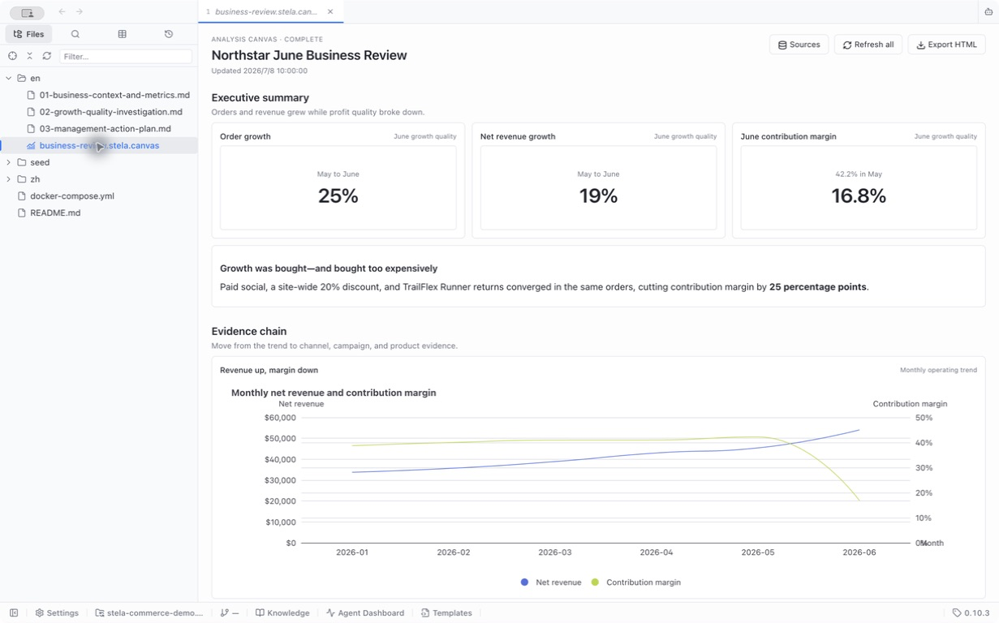
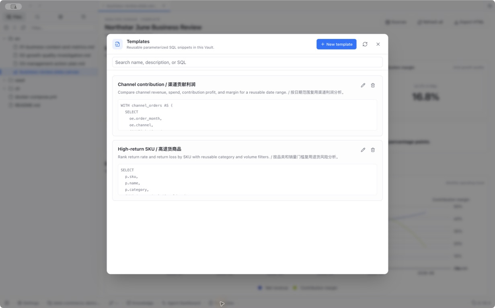
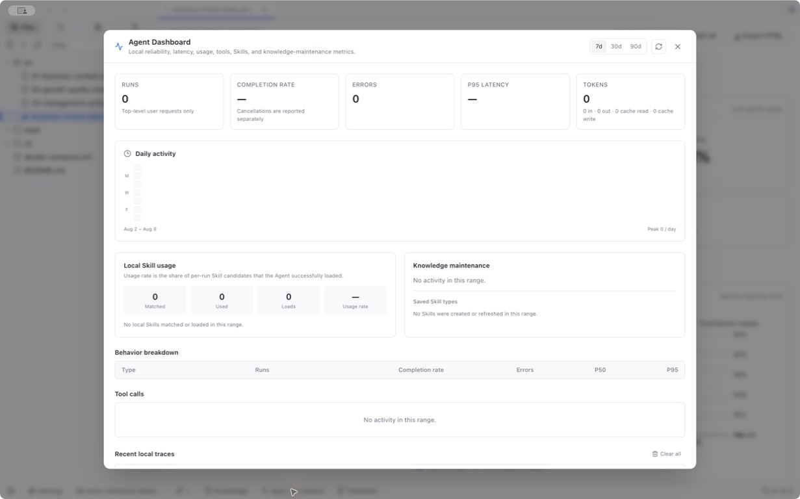
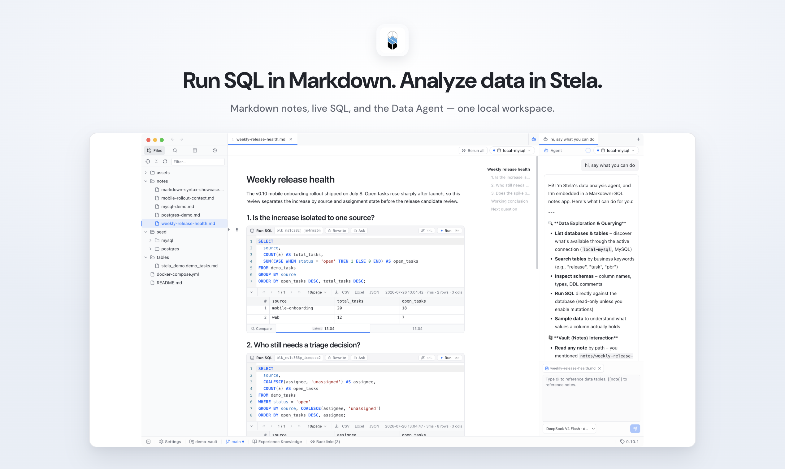
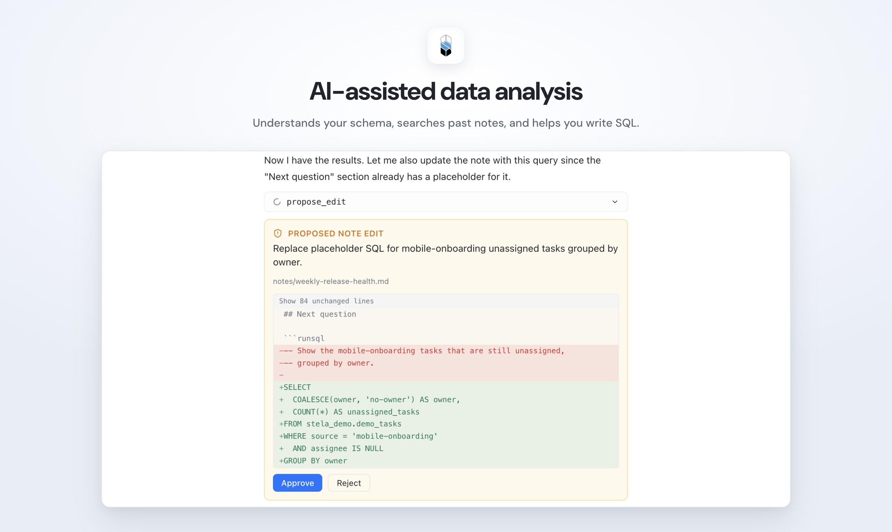
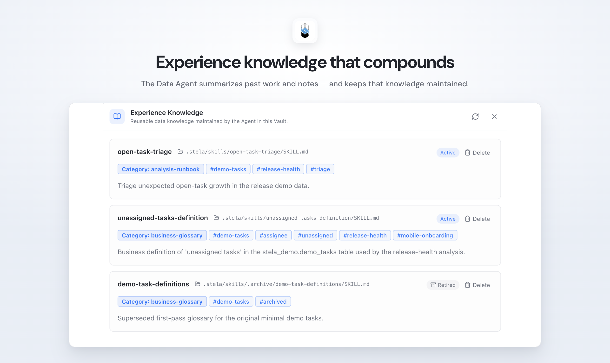
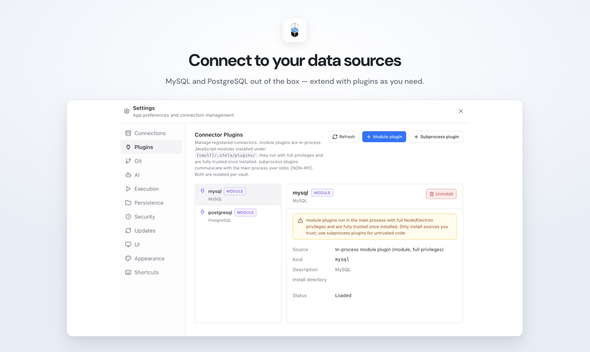

<p align="center">
  
</p>

<h1 align="center">Stela</h1>

<p align="center">
  <strong>Run SQL in Markdown. Analyze data in Stela.</strong>
</p>

<p align="center">
  <a href="https://www.producthunt.com/products/stela-data-analysis-workspace?embed=true&amp;utm_source=badge-featured&amp;utm_medium=badge&amp;utm_campaign=badge-stela-data-analysis-workspace" target="_blank" rel="noopener noreferrer"></a>
</p>

<p align="center">
  <a href="#english">English</a> · <a href="#中文">中文</a> · <a href="#screenshots--产品截图">Screenshots</a>
</p>

---

## English

**Stela is an AI-native data workspace that brings SQL and analysis into your Markdown notes.**

Stop switching between note-taking apps, SQL clients, and AI chat windows. Stela combines them all in one place: write your analysis in Markdown, run SQL queries directly in your notes, and let the Data Agent handle the heavy lifting—all while keeping your data local and portable.

The built-in **Try Demo Vault** follows one complete commerce review: Northstar Outfitters grows June orders by 25%, but contribution margin falls from 42.2% to 16.8%. Connect its MySQL fixture, follow the audited SQL evidence, present the decision in Canvas, ask the Agent to verify it, inspect that real run in Agent Dashboard, and reuse the analysis through SQL templates. The same Vault includes English and Chinese walkthroughs.

### What you can do with Stela

- **AI-assisted data analysis** — The Data Agent understands your database schema, searches past queries and notes, and helps you write SQL, interpret results, and spot anomalies. Use `@table` to reference database objects and `[[note]]` to link your analysis notes—the Agent reads them as context.

- **Analysis Canvas** — Turn audited query results into a structured, Git-trackable `*.stela.canvas` with KPI, chart, table, narrative, and flow cards. Ask the Agent to atomically re-analyze current data, adjust flow layout, or export the whole canvas as HTML.

- **Reusable SQL templates** — Keep parameterized SQL as ordinary Markdown files inside the vault. Insert a template with `Mod+Alt+T`; repeated `{{variables}}` edit together and move with `Tab` / `Shift+Tab`.

- **Agent Dashboard** — Inspect local completion rate, latency, token usage, tool calls, Skill usage, knowledge-maintenance outcomes, and redacted traces. Metrics remain in a Git-ignored, 90-day local store.

- **SQL that lives in your notes** — Drop a `runsql` block anywhere in a Markdown note. The query, its results, and your commentary stay together in one file. No more scattered scratchpads.

- **Connect to your data sources** — Bundled plugins support MySQL, PostgreSQL, and MongoDB out of the box. The plugin system and HTTP gateway example make it easy to add any other data source you need.

- **Sandboxed Python analysis** — The Data Agent can analyze query artifacts with Pyodide, DuckDB, pandas, and NumPy without requiring a system Python installation or exposing host filesystem and network access.

- **Keep a complete audit trail** — Every query, including failures, is logged. Compare execution results side by side, inspect metadata, or export a note when you need to share your findings.

- **Wiki-style note linking** — Use `[[wikilinks]]` to connect related notes, with automatic backlinks. Search across note content, table names, column names, or even past query usage.

- **Your data, your tools, your control** — Notes are plain `*.md` files—open them in VS Code, Obsidian, or any Markdown editor. Execution history is stored as append-only JSONL in `.stela/history/`, and the local SQLite cache can be rebuilt anytime.

### Quick example

````markdown
```runsql
SELECT oe.channel,
       ROUND(SUM(oe.profit_before_marketing) - ms.spend, 2) AS contribution_profit
FROM order_economics oe
JOIN marketing_spend ms
  ON ms.channel = oe.channel AND ms.month = oe.order_month
WHERE oe.order_month = '2026-06'
GROUP BY oe.channel, ms.spend
ORDER BY contribution_profit;
```
````


That's it. Write the question, run the SQL, and keep the answer right next to it.

### Why Stela?

Stela is built for the kind of data work that starts with a question in a notebook and ends with a query that answers it. Instead of juggling tools, you keep everything—the question, the SQL, the results, and the reasoning—in one folder. And because your notes are standard Markdown, you're never locked in.

### Get started

1. [Download Stela from GitHub Releases](https://github.com/ay27/Stela/releases/latest)

2. Choose **Try Demo Vault** for the complete bilingual Northstar commerce review, or open your own folder as a vault.

3. Add a database connection in Settings: give it a name, pick the database type, enter the connection details, and test it.

4. Create a note, select your connection, and add a `runsql` block. Stela saves the query result and run history right alongside your vault.

For system design and contributor information, see [Architecture](./docs/ARCHITECTURE.md), [Abstractions](./docs/ABSTRACTIONS.md), and the [ADRs](./docs/adr/).

---

## Screenshots / 产品截图

### One analysis, from evidence to action / 一场从证据到行动的完整分析

<p align="center">
  
  <br />
  <strong>Analysis Canvas / 分析画布</strong> — Revenue grew while contribution margin collapsed; channel, promotion, return evidence, and the July response stay in one audited view. / 收入增长但贡献利润率骤降，渠道、促销、退货证据和七月行动都在同一个可审计视图中。
</p>

<table>
  <tr>
    <td width="50%">
      
      <br />
      <strong>SQL Templates / SQL 模板</strong><br />
      Reuse the channel and high-return-SKU investigation with linked variables. / 用联动变量复用渠道和高退货商品诊断。
    </td>
    <td width="50%">
      
      <br />
      <strong>Agent Dashboard</strong><br />
      Starts empty by design, then records the real Agent run that verifies and updates the Canvas. / 初始保持空白，运行复核任务后记录更新 Canvas 的真实 Agent 行为。
    </td>
  </tr>
</table>

### More workflows / 更多工作流

<table>
  <tr>
    <td width="50%">
      
      <br />
      <strong>Run SQL in Markdown / 在 Markdown 中运行 SQL</strong>
    </td>
    <td width="50%">
      
      <br />
      <strong>AI-assisted data analysis / AI 辅助数据分析</strong>
    </td>
  </tr>
  <tr>
    <td width="50%">
      
      <br />
      <strong>Experience knowledge / 经验知识沉淀</strong>
    </td>
    <td width="50%">
      
      <br />
      <strong>Connect to your data sources / 连接数据源</strong>
    </td>
  </tr>
</table>

---

## 中文

<p align="center">
  <strong>Stela：在 Markdown 笔记里跑 SQL 的 AI 数据分析工作台</strong>
</p>

**Stela 是专为数据从业者设计的 AI 工作台，将笔记、SQL 和 AI 分析融合在同一个 Markdown 环境中。**

日常工作中，你可以在记录分析思路的同时直接执行 SQL 查询，让 Data Agent 帮你完成历史对比、异常检测和数据洞察——所有操作都在本地完成，数据始终掌握在你自己手中。

内置的 **Try Demo Vault** 是一场完整的电商经营复盘：Northstar Outfitters 六月订单增长 25%，贡献利润率却从 42.2% 跌至 16.8%。你会连接 MySQL、沿着可审计 SQL 逐层定位问题、在 Canvas 汇总决策、让 Agent 复核、在 Agent Dashboard 检查这次真实运行，最后用 SQL 模板复用分析。中英文流程位于同一个 Vault。

### 核心能力

- **原生 Markdown 兼容** — 所有笔记都是标准 `*.md` 文件，可用任意笔记软件或 IDE 打开，数据永不锁定。

- **分析画布** — 把可审计的查询结果组织成 `*.stela.canvas`，在同一画布展示 KPI、图表、表格、说明文字和流程图；支持 Agent 基于最新数据原子重分析、调整流程布局和导出 HTML。

- **SQL 模板** — 参数化 SQL 以普通 Markdown 文件保存在 Vault 中。按 `Mod+Alt+T` 插入模板；同名 `{{变量}}` 会联动编辑，并可用 `Tab` / `Shift+Tab` 依次跳转。

- **Agent Dashboard** — 本地查看完成率、耗时、Token、工具调用、Skill 使用、知识维护结果与脱敏 Trace；指标保存在 Git 忽略的 90 天本地存储中。

- **连接任何数据源** — 内置插件支持 MySQL、PostgreSQL 与 MongoDB，也可以通过插件系统继续扩展其他数据源。

- **沙箱 Python 分析** — Data Agent 可以使用 Pyodide、DuckDB、pandas 与 NumPy 分析查询结果，无需安装系统 Python，也不会获得宿主文件系统或网络访问权限。

- **AI 原生数据分析** — 内置 Data Agent 辅助写 SQL、解读查询结果、自动生成分析报告。

- **本地优先，隐私可控** — 数据不出本地，支持接入任意 OpenAI 兼容的 LLM API。

### 示例

````markdown
```runsql
SELECT oe.channel,
       ROUND(SUM(oe.profit_before_marketing) - ms.spend, 2) AS contribution_profit
FROM order_economics oe
JOIN marketing_spend ms
  ON ms.channel = oe.channel AND ms.month = oe.order_month
WHERE oe.order_month = '2026-06'
GROUP BY oe.channel, ms.spend
ORDER BY contribution_profit;
```
````

问题、查询和结果，全部留在同一篇笔记里。

### 为什么用 Stela？
Stela 适合那些从“我想看看数据”这个念头开始做分析的人。说明文字、SQL 和执行历史都放在同一个文件夹里，不用在不同的工具之间切来切去。笔记是纯 Markdown 格式，用 VS Code、GitHub、Obsidian 或其他工具都能打开，永远不会被格式绑架。

### 快速体验
1. [从 GitHub Releases 下载 Stela](https://github.com/ay27/Stela/releases/latest)

2. 选择 **Try Demo Vault** 体验完整的中英文 Northstar 电商复盘，或打开自己的文件夹作为笔记库。

3. 在“设置”中添加数据库连接：填写连接名称、选择数据库类型、输入连接信息，然后测试连接。

4. 新建一篇笔记，选中配置好的连接，再插入一个 runsql 代码块即可开始。查询结果和执行历史会跟着笔记库一起保存。


系统设计和贡献者相关细节见 [Architecture](./docs/ARCHITECTURE.md)、[Abstractions](./docs/ABSTRACTIONS.md) 与 [ADR](./docs/adr/)。
