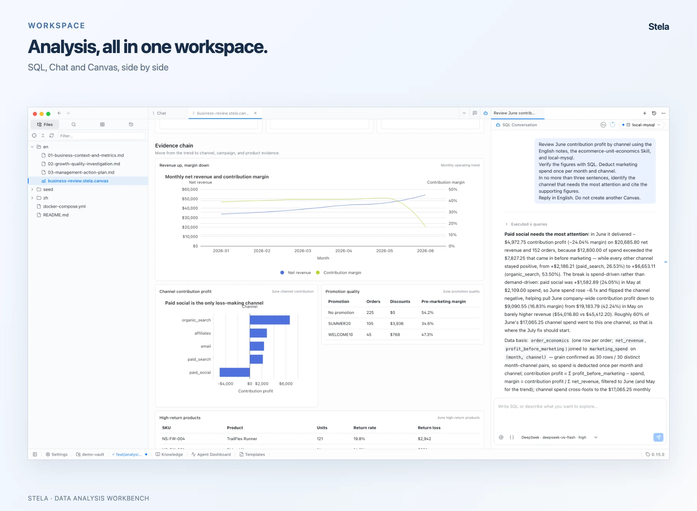
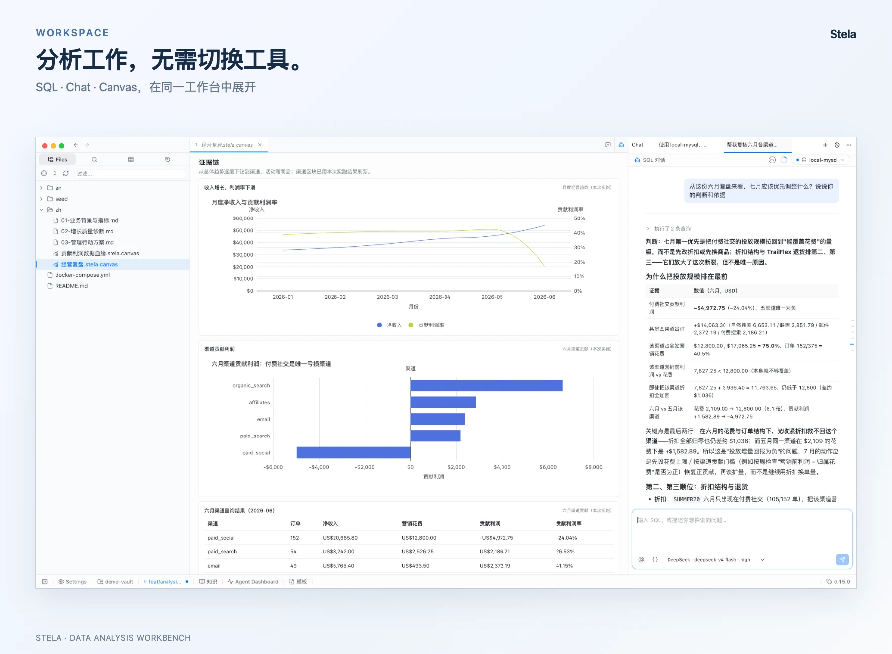

<p></p>

# Stela — Your AI Workbench for Data Analysis

Run SQL in Markdown. Analyze data in Stela.

Develop your thinking in SQL notes, with queries and AI analysis in the same workflow. Carry an investigation through to a report, and build on the experience in your next analysis.

[Windows](https://github.com/ay27/Stela/releases/latest/download/Stela-windows-x64.exe) · [Mac (Apple Silicon)](https://github.com/ay27/Stela/releases/latest/download/Stela-mac-arm64.dmg) · [Website](https://ay27.github.io/Stela/?lang=en) · [中文](#中文)

[](./docs/assets/screenshots/en-workspace.png)

## What you can do with Stela

### SQL in Markdown

**SQL in your notes, with the reasoning and results preserved**

Write and execute SQL directly in Markdown notes. Use the results to record your reasoning and test hypotheses, keeping questions, queries, and conclusions together as a complete analysis.

Reopen a note to review the evidence, update a query, and continue the analysis.

[](./docs/assets/screenshots/en-markdown.png)

### SQL in Chat

**From SQL to AI analysis, in one continuous conversation**

Combine SQL with natural language, and review query results, analysis, and charts in the same conversation. Follow up on the results to investigate further.

AI can correct clear syntax errors and continue execution, keeping query fixes and analysis within the same workflow.

[](./docs/assets/screenshots/en-chat.png)

### Stela Agent

**Find context in your notes. Test it against your data.**

Designed specifically for data analysis, Stela Agent finds business context in past notes, uses database schemas to write and execute SQL, and calculates with Python. Query results inform the next steps of the analysis and the charts it creates.

Start a task in Chat or continue beside a document. Inspect tool calls, queries, and results to review the evidence behind the analysis.

The Agent can assemble findings, charts and query results into a Canvas report, update it as the analysis evolves, and export it as HTML to share.

[](./docs/assets/screenshots/en-agent.png)

### Data lineage

**Trace each number back to its source**

Connect source data, calculations and final metrics in a flowchart. Include actual amounts and row counts to make each step verifiable.

[](./docs/assets/screenshots/en-lineage.png)

### Automatic knowledge maintenance

**Turn analysis experience into reusable business knowledge**

Stela gathers lessons from past notes and analysis records into knowledge Skills. Confirmed metric definitions, query methods, and solutions to earlier problems become references for future analyses.

The Agent retrieves and applies this knowledge to relevant tasks, building its understanding of the business over time. You can review, edit, and maintain the knowledge.

[](./docs/assets/screenshots/en-knowledge.png)

### Database connector plugins

**Connect the databases you need through plugins**

Use connector plugins to support different databases. Configure and manage connections in one place for SQL queries and Agent analysis.

Build a custom plugin for a specific database or internal data service to bring it into the Stela analysis workflow.

[](./docs/assets/screenshots/en-plugins.png)

## The details that support your daily work

| Feature | Details |
| --- | --- |
| Local-first | Notes and analysis records live in a local vault. Your files stay in your hands. |
| Git-based sync | Sync notes and execution history through a Git repository, with a version history you can trace. |
| Inline AI SQL completion | Continue SQL at the RunSQL cursor. Press Tab to accept a suggestion or Esc to dismiss it. |
| Schema-aware editing | Syntax highlighting, formatting, and table and column completion help you write queries. |
| Query execution history | Keep executed SQL and its results. Review the evidence and pick up where you left off. |
| HTML report export | Export a Canvas as HTML to share your findings with colleagues. |

## Get started

1. Download Stela and open or create a Vault.
2. Install a database connector plugin and configure a connection in Settings.
3. Add a runsql block to a Markdown note, then write and run SQL.
4. Configure a model provider to analyze data and create charts and Canvas with the Agent.

[Explore the Demo Vault](./examples/demo-vault/README.md) — Includes notes, saved results, and Canvas files you can open right away.

## Develop & contribute

Stela is built with Electron, React, and TypeScript. Report issues, improve features, or build a connector plugin.

```bash
git clone https://github.com/ay27/Stela.git
cd Stela
npm install
npm run dev
```

[Architecture](./docs/ARCHITECTURE.md) · [Abstractions](./docs/ABSTRACTIONS.md) · [ADRs](./docs/adr/) · [Keyboard shortcuts](./docs/keybindings.md)

`npm install` enables the tracked pre-commit hook. `npm run check:precommit` runs tests, the public-release gate, and the production build. The build checks renderer types and Electron symbols/imports; `npm run check:main-types` separately reports strict main-process diagnostics.

---

## 中文

### Stela，面向数据分析的 AI 工作台

以 SQL 笔记承载思考，将查询执行与 AI 分析融入同一工作流。从探索数据到形成报表，让分析连贯展开，让经验持续积累。

[Windows 下载](https://github.com/ay27/Stela/releases/latest/download/Stela-windows-x64.exe) · [Mac 下载（Apple Silicon）](https://github.com/ay27/Stela/releases/latest/download/Stela-mac-arm64.dmg) · [官网](https://ay27.github.io/Stela/?lang=zh)

[](./docs/assets/screenshots/zh-workspace.png)

## Stela 能做什么

### SQL in Markdown

**SQL 写进笔记，思路与结果一并留存**

在 Markdown 笔记中直接编写、执行 SQL，结合查询结果记录判断、验证假设。问题、查询与结论相互关联，保留完整的分析脉络。

再次打开笔记，既可追溯依据，也可更新查询，延续此前的分析。

[](./docs/assets/screenshots/zh-markdown.png)

### SQL in Chat

**从 SQL 到 AI 分析，一气呵成**

SQL 与自然语言可以混合输入，查询结果、分析解读和图表在同一段对话中呈现。围绕结果继续追问，即可深入分析。

遇到明确的语法错误，AI 可自动修正并继续执行，让查询、纠错与分析自然衔接。

[](./docs/assets/screenshots/zh-chat.png)

### Stela Agent

**循迹于笔记，求证于数据**

面向数据分析领域专门设计的 Stela Agent，会查找历史笔记中的业务线索，结合表结构编写并执行 SQL，调用 Python 计算，并依据查询结果展开后续分析、生成所需图表。

可在 Chat 中发起任务，也可在文档旁继续分析。工具调用、查询与结果均可查看，分析依据清晰可查。

Agent 可将分析结论、图表与查询结果整理为 Canvas 报表，持续更新，并导出 HTML 分享。

[](./docs/assets/screenshots/zh-agent.png)

### 数据血缘图

**数据有来路，指标有依据**

用流程图串联数据来源、计算过程与最终指标。结合实际金额与数据量，让每一步转换都有据可循。

[](./docs/assets/screenshots/zh-lineage.png)

### 自动知识维护

**积累分析经验，形成可复用的业务知识**

Stela 从历史笔记与分析记录中整理经验教训，保存为知识 Skill。经过确认的指标口径、查询方法与问题处理经验，成为后续分析的参考。

Agent 在相关任务中检索并使用这些知识，逐步积累对业务的理解。知识内容可查看、编辑和维护。

[](./docs/assets/screenshots/zh-knowledge.png)

### 插件化数据库连接

**通过插件，接入所需数据库**

以连接器插件适配不同数据库，在统一入口配置和管理连接，供 SQL 查询与 Agent 分析使用。

针对特定数据库或内部数据服务，也可开发自定义插件，将其接入 Stela 的分析工作流。

[](./docs/assets/screenshots/zh-plugins.png)

## 日常分析，也照顾周全

| 功能 | 说明 |
| --- | --- |
| Local-first | 笔记与分析记录保存在本地 Vault，文件由你掌握。 |
| 基于 Git 的同步 | 通过 Git 仓库同步笔记与执行历史，保留可追溯的版本记录。 |
| SQL 行内 AI 补全 | 在 RunSQL 光标处续写 SQL，按 Tab 接受建议，按 Esc 忽略。 |
| 懂表结构的编辑器 | 语法高亮、格式化与表名、字段补全，让查询编写更顺手。 |
| 查询执行历史 | 保留执行过的 SQL 与结果，回看分析依据，接续此前的工作。 |
| HTML 报表导出 | 将 Canvas 导出为 HTML，方便向同事分享分析成果。 |

## 开始使用

1. 下载 Stela，打开或创建一个 Vault。
2. 安装数据库连接器插件，在设置中配置连接。
3. 在 Markdown 中添加 runsql 块，编写并运行 SQL。
4. 配置模型服务，即可让 Agent 分析数据、生成图表和 Canvas。

[先浏览 Demo Vault](./examples/demo-vault/README.md) — 包含可直接打开的笔记、已保存结果和 Canvas。

## 开发与贡献

Stela 使用 Electron、React 和 TypeScript。欢迎报告问题、改进功能或开发连接器插件。

```bash
git clone https://github.com/ay27/Stela.git
cd Stela
npm install
npm run dev
```

[Architecture](./docs/ARCHITECTURE.md) · [Abstractions](./docs/ABSTRACTIONS.md) · [ADRs](./docs/adr/) · [Keyboard shortcuts](./docs/keybindings.md)

`npm install` 会启用提交前检查。`npm run check:precommit` 运行测试、公开发布检查与生产构建；构建包含 Renderer 类型及 Electron 符号／导入检查，主进程严格类型诊断通过 `npm run check:main-types` 单独检查。
