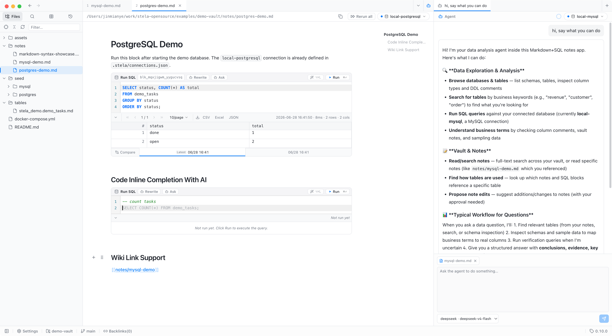
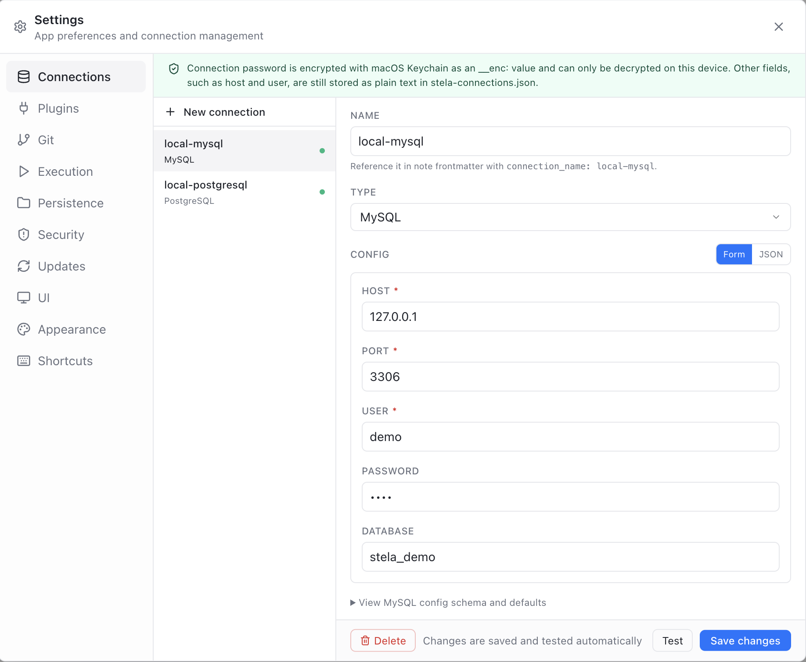
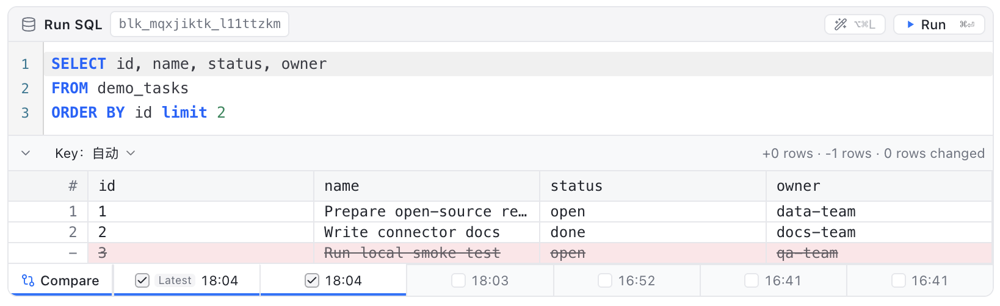
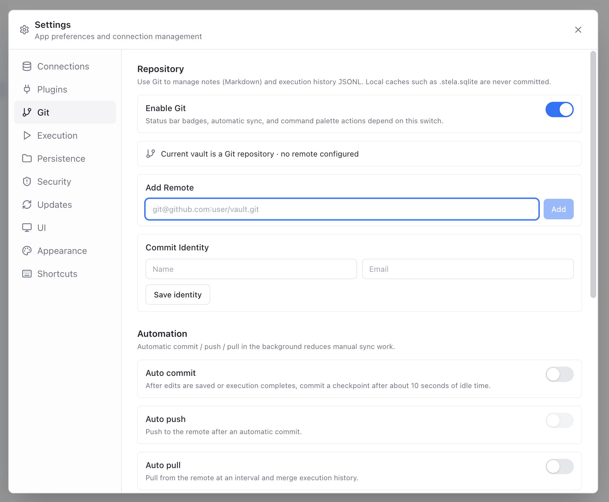
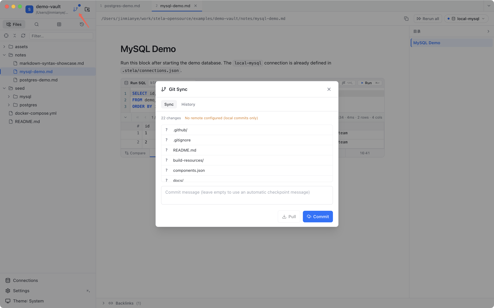
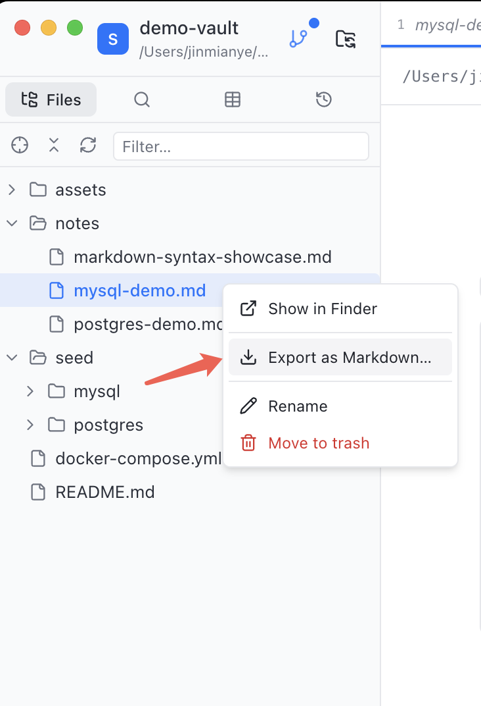
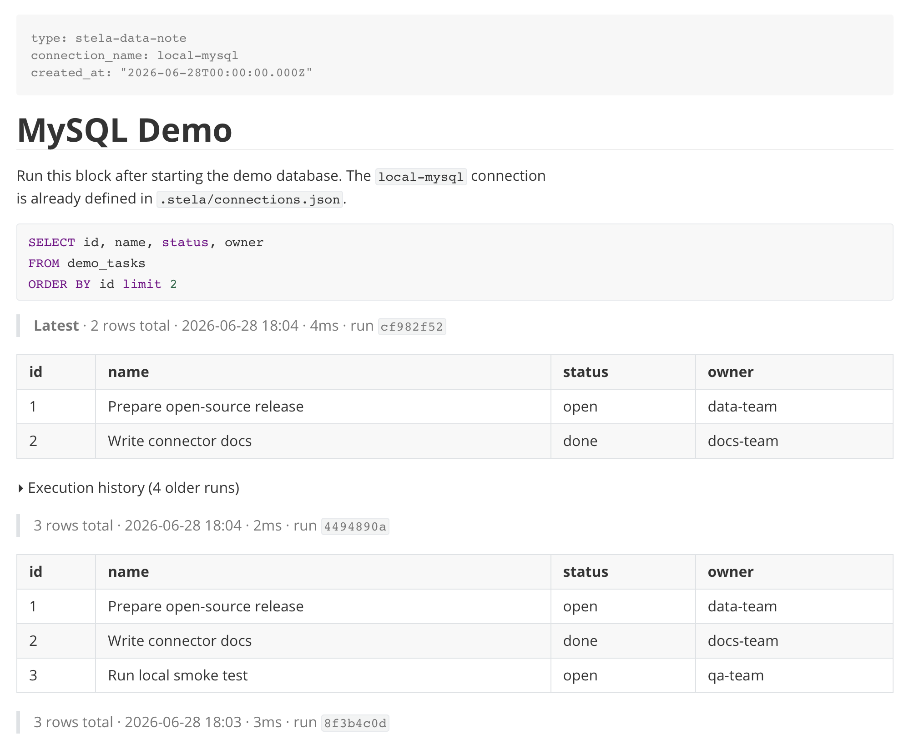

<p align="center">
  
</p>

<h1 align="center">Stela</h1>

<p align="center">
  <strong>把数据库装进 Markdown 笔记的 AI 数据分析工作台</strong>
</p>

<p align="center">
  <a href="#english">English</a> · <a href="#中文">中文</a> · <a href="#screenshots--产品截图">Screenshots</a>
</p>

---

## English

**Stela is an AI-native data workspace that brings SQL and analysis into your Markdown notes.**

Stop switching between note-taking apps, SQL clients, and AI chat windows. Stela combines them all in one place: write your analysis in Markdown, run SQL queries directly in your notes, and let the Data Agent handle the heavy lifting—all while keeping your data local and portable.

### What you can do with Stela

- **AI-assisted data analysis** — The Data Agent understands your database schema, searches past queries and notes, and helps you write SQL, interpret results, and spot anomalies. Use `@table` to reference database objects and `[[note]]` to link your analysis notes—the Agent reads them as context.

- **SQL that lives in your notes** — Drop a `runsql` block anywhere in a Markdown note. The query, its results, and your commentary stay together in one file. No more scattered scratchpads.

- **Connect to your data sources** — Bundled plugins support MySQL and PostgreSQL out of the box. The plugin system and HTTP gateway example make it easy to add any other data source you need.

- **Keep a complete audit trail** — Every query, including failures, is logged. Compare execution results side by side, inspect metadata, or export a note when you need to share your findings.

- **Wiki-style note linking** — Use `[[wikilinks]]` to connect related notes, with automatic backlinks. Search across note content, table names, column names, or even past query usage.

- **Your data, your tools, your control** — Notes are plain `*.md` files—open them in VS Code, Obsidian, or any Markdown editor. Execution history is stored as append-only JSONL in `.stela/history/`, and the local SQLite cache can be rebuilt anytime.

### Quick example

````markdown
```runsql
SELECT status, COUNT(*) AS total
FROM tasks
GROUP BY status;
```
````


That's it. Write the question, run the SQL, and keep the answer right next to it.

### Why Stela?

Stela is built for the kind of data work that starts with a question in a notebook and ends with a query that answers it. Instead of juggling tools, you keep everything—the question, the SQL, the results, and the reasoning—in one folder. And because your notes are standard Markdown, you're never locked in.

### Get started

1. [Download Stela from GitHub Releases](https://github.com/ay27/Stela/releases/latest)

2. Create or open a vault—a regular folder where Stela stores your notes and its `.stela` data.

3. Add a database connection in Settings: give it a name, pick the database type, enter the connection details, and test it.

4. Create a note, select your connection, and add a `runsql` block. Stela saves the query result and run history right alongside your vault.

For system design and contributor information, see [Architecture](./docs/ARCHITECTURE.md), [Abstractions](./docs/ABSTRACTIONS.md), and the [ADRs](./docs/adr/).

---

## Screenshots / 产品截图

<p align="center">
  
</p>

<table>
  <tr>
    <td width="50%">
      
      <br />
      <strong>Database connections / 数据库连接</strong>
    </td>
    <td width="50%">
      
      <br />
      <strong>Execution history and diff / 执行历史与结果对比</strong>
    </td>
  </tr>
  <tr>
    <td width="50%">
      
      <br />
      <strong>Git repository settings / Git 仓库设置</strong>
    </td>
    <td width="50%">
      
      <br />
      <strong>Git sync and history / Git 同步与历史</strong>
    </td>
  </tr>
  <tr>
    <td width="50%">
      
      <br />
      <strong>Markdown export options / Markdown 导出选项</strong>
    </td>
    <td width="50%">
      
      <br />
      <strong>Exported Markdown result / 导出后的 Markdown 结果</strong>
    </td>
  </tr>
</table>

---

## 中文

<p align="center">
  <strong>Stela：在 Markdown 笔记里跑 SQL 的 AI 数据分析工作台</strong>
</p>

**Stela 是专为数据从业者设计的 AI 工作台，将笔记、SQL 和 AI 分析融合在同一个 Markdown 环境中。**

日常工作中，你可以在记录分析思路的同时直接执行 SQL 查询，让 Data Agent 帮你完成历史对比、异常检测和数据洞察——所有操作都在本地完成，数据始终掌握在你自己手中。

### 核心能力

- **原生 Markdown 兼容** — 所有笔记都是标准 `*.md` 文件，可用任意笔记软件或 IDE 打开，数据永不锁定。

- **连接任何数据源** — 通过插件系统接入 MySQL、PostgreSQL 等主流数据库，一个工作台管理所有数据。

- **AI 原生数据分析** — 内置 Data Agent 辅助写 SQL、解读查询结果、自动生成分析报告。

- **本地优先，隐私可控** — 数据不出本地，支持接入任意 OpenAI 兼容的 LLM API。

### 示例

````markdown
```runsql
SELECT status, COUNT(*) AS total
FROM tasks
GROUP BY status;
```
````

问题、查询和结果，全部留在同一篇笔记里。

### 为什么用 Stela？
Stela 适合那些从“我想看看数据”这个念头开始做分析的人。说明文字、SQL 和执行历史都放在同一个文件夹里，不用在不同的工具之间切来切去。笔记是纯 Markdown 格式，用 VS Code、GitHub、Obsidian 或其他工具都能打开，永远不会被格式绑架。

### 快速体验
1. [从 GitHub Releases 下载 Stela](https://github.com/ay27/Stela/releases/latest)

2. 新建或打开一个笔记库。笔记库就是一个普通文件夹，Stela 会把 Markdown 笔记和自身的 .stela 数据都放在里面。

3. 在“设置”中添加数据库连接：填写连接名称、选择数据库类型、输入连接信息，然后测试连接。

4. 新建一篇笔记，选中配置好的连接，再插入一个 runsql 代码块即可开始。查询结果和执行历史会跟着笔记库一起保存。


系统设计和贡献者相关细节见 [Architecture](./docs/ARCHITECTURE.md)、[Abstractions](./docs/ABSTRACTIONS.md) 与 [ADR](./docs/adr/)。
