<p></p>

# Stela — Your AI Workbench for Data Analysis

Run SQL in Markdown. Analyze data in Stela.

Run SQL in your notes and conversations, or ask an Agent to query data, write code, and create charts. Keep the work in local files and build a knowledge base your Agent can use in future analyses.

[Download](https://github.com/ay27/Stela/releases/latest) · [Website](https://ay27.github.io/Stela/?lang=en) · [中文](#中文)


## What you can do with Stela

### SQL in Markdown

**Write and run SQL inside your notes.** Add a runsql block to a Markdown note to query your database and view a result table. The editor includes syntax highlighting, database completion, and formatting.

Keep the business context, query, and explanation together. Results and execution history are saved, so you can reopen the note and continue your work.

[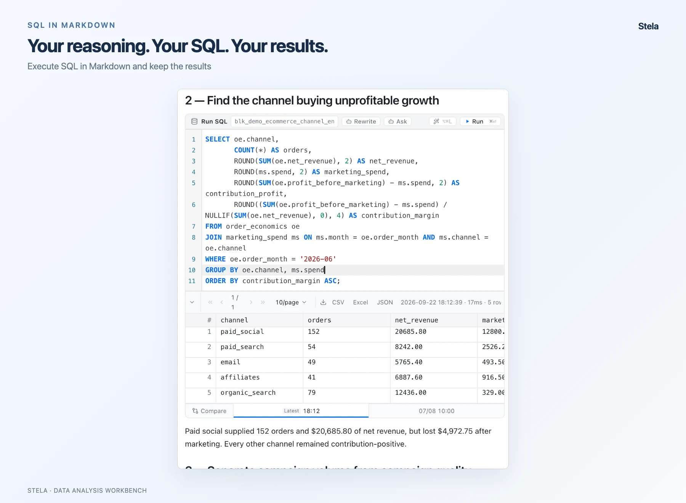](./docs/assets/screenshots/en-markdown.png)

### SQL in Chat

**One input for SQL and questions.** Executable SQL returns a result table. Questions and input mixing SQL with natural language go to the Agent. When a query needs work, the Agent can help correct it and continue the analysis.

Ask follow-up questions and create charts or flow diagrams in the same conversation. Reference notes, Canvas files, and SQL blocks with @ to bring existing work into the discussion.

> SQL Chat is a development preview. Check Releases for availability in downloadable builds.

[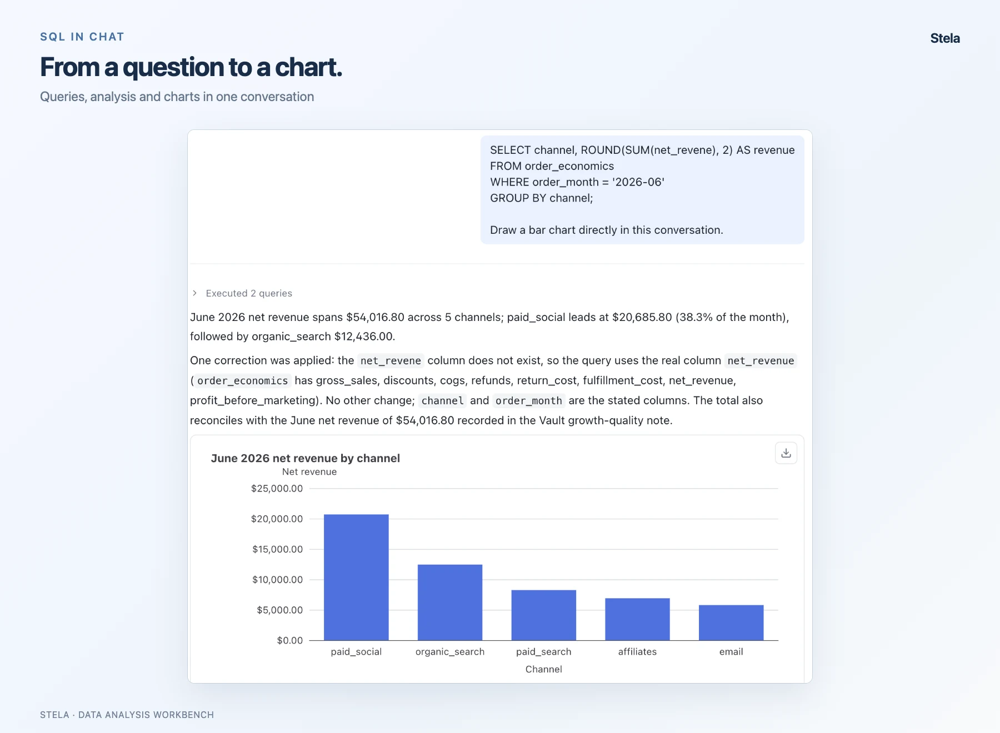](./docs/assets/screenshots/en-chat.png)

### Data Agent

**An Agent that works with your data across multiple steps.** Built on Pi, the Agent can look up schemas and business notes, write and execute SQL, calculate with Python, and investigate further based on the results.

Inspect tool calls, SQL, and results as the analysis progresses. Ask follow-up questions, adjust queries, or have the Agent write findings into notes and Canvas. Agent Panel opens beside your current document.

[Built on Pi](https://github.com/earendil-works/pi)

[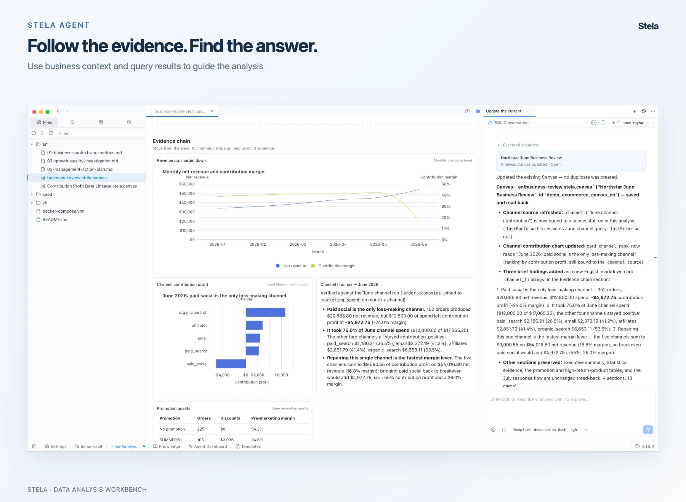](./docs/assets/screenshots/en-agent.png)

### Canvas

**Put charts, tables, and findings in one analysis canvas.** Combine metrics, charts, result tables, text, and flow diagrams. Have the Agent create a Canvas, then edit its contents, keep the underlying queries, and refresh the data.

A Canvas is saved as its own file. Reopen it to continue working, or export it as HTML to share the analysis.

[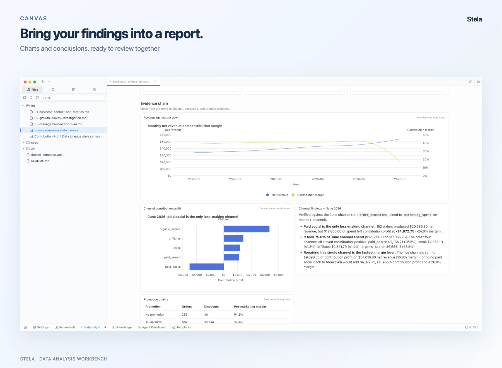](./docs/assets/screenshots/en-canvas.png)

[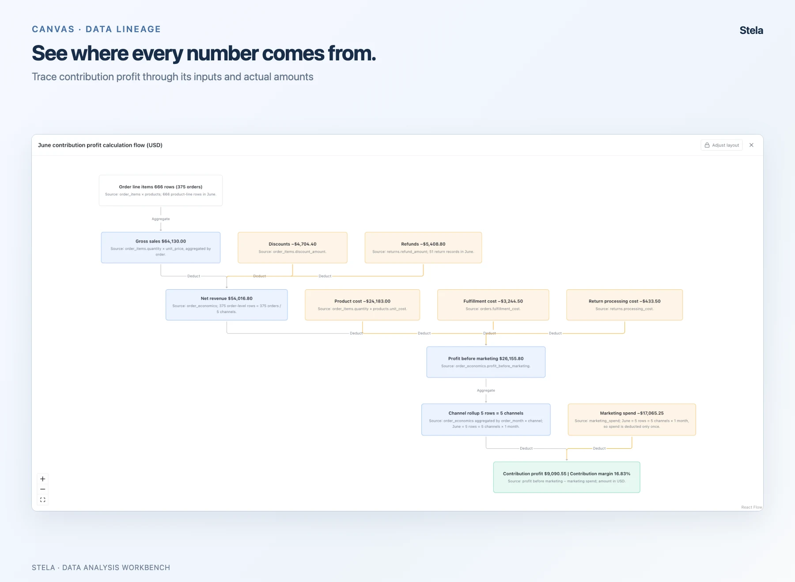](./docs/assets/screenshots/en-lineage.png)

### Notes & automatic knowledge maintenance

**Keep your analysis history and give the Agent more business context.** Stela is also a note-taking app. Scripts, queries, conversations, and analysis records stay in your Vault. Automatic knowledge maintenance extracts supported, reusable guidance, such as metric definitions, table relationships, and query methods.

In later analyses, the Agent can find and use that knowledge, so you spend less time explaining the same business context. Knowledge is stored in readable, editable files that you can inspect and change.

[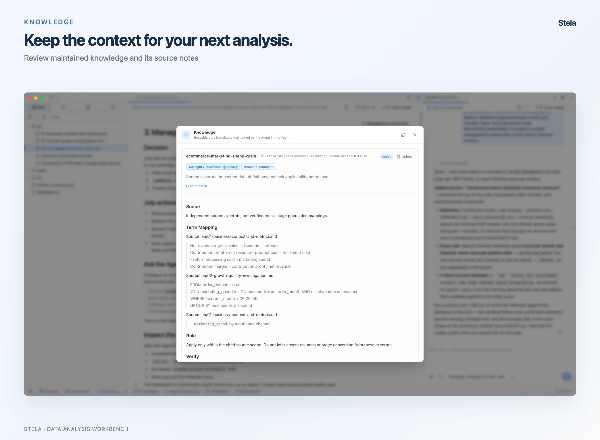](./docs/assets/screenshots/en-knowledge.png)

### Database connector plugins

**Manage connections in one place. Add data sources through plugins.** Install connector plugins in Settings, then configure, test, and manage your database connections. Markdown, Chat, and the Agent use these connections to access data.

The release configuration includes MySQL, PostgreSQL, and an HTTP connector example. You can build a connector plugin for other data sources.

[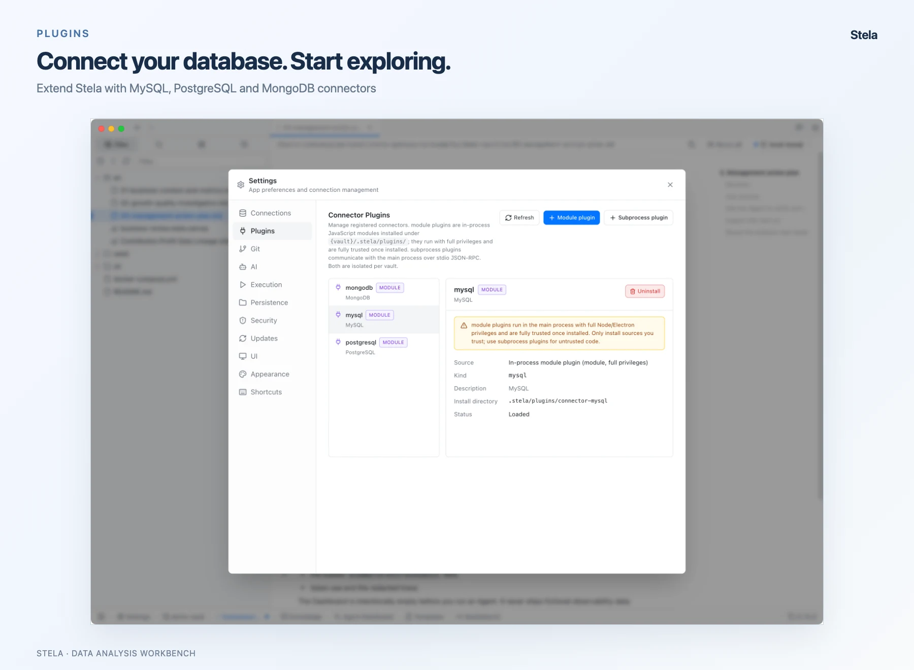](./docs/assets/screenshots/en-plugins.png)

### Local-first

**Your work lives in a folder you control.** A Vault is a local working folder. It holds your Markdown notes, Chat files, Canvas files, and execution records. Back it up, move it, and use Git to track changes.

SQL runs on your connected database. When you use AI, relevant context is sent to your configured model provider. Notes and SQL work without enabling AI.

[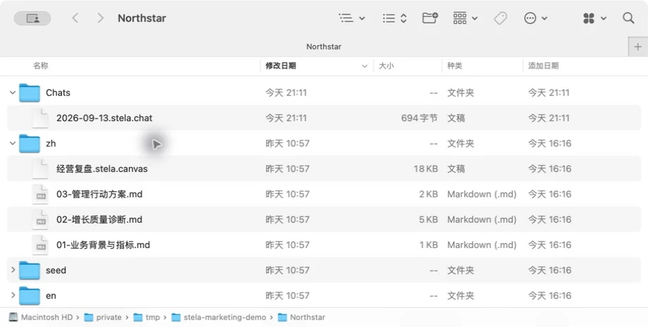](./docs/assets/product/local.png)

## Get started

1. Download Stela and open or create a Vault.
2. Install a database connector plugin and configure a connection in Settings.
3. Add a runsql block to a Markdown note, then write and run SQL.
4. Configure a model provider to analyze data and create charts and Canvas with the Agent.

[Explore the Demo Vault](./examples/demo-vault/README.md) — Includes notes, saved results, and Canvas files you can open right away.

## Develop & contribute

Stela is built with Electron, React, and TypeScript. Report issues, improve features, or build a connector plugin.

```bash
git clone https://github.com/ay27/Stela.git
cd Stela
npm install
npm run dev
```

[Architecture](./docs/ARCHITECTURE.md) · [Abstractions](./docs/ABSTRACTIONS.md) · [ADRs](./docs/adr/) · [Keyboard shortcuts](./docs/keybindings.md)

`npm install` enables the tracked pre-commit hook. `npm run check:precommit` runs tests, the public-release gate, and the production build. The build checks renderer types and Electron symbols/imports; `npm run check:main-types` separately reports strict main-process diagnostics.

---

## 中文

### Stela，面向数据分析的 AI 工作台

在笔记和对话中直接运行 SQL，也可以让 Agent 查询数据、编写代码、生成图表。分析过程与结论保存在本地，并逐步整理成 Agent 可以复用的知识。

[下载](https://github.com/ay27/Stela/releases/latest) · [官网](https://ay27.github.io/Stela/?lang=zh)

## Stela 能做什么

### SQL in Markdown

**把 SQL 写进笔记，并直接执行。** 在 Markdown 中插入 runsql 代码块，就能连接数据库、执行查询、查看结果表格。编辑器支持代码高亮、数据库补全与格式化。

业务背景、SQL 和分析说明写在一起，查询结果与执行历史也会保存。以后打开笔记，可以接着分析。

[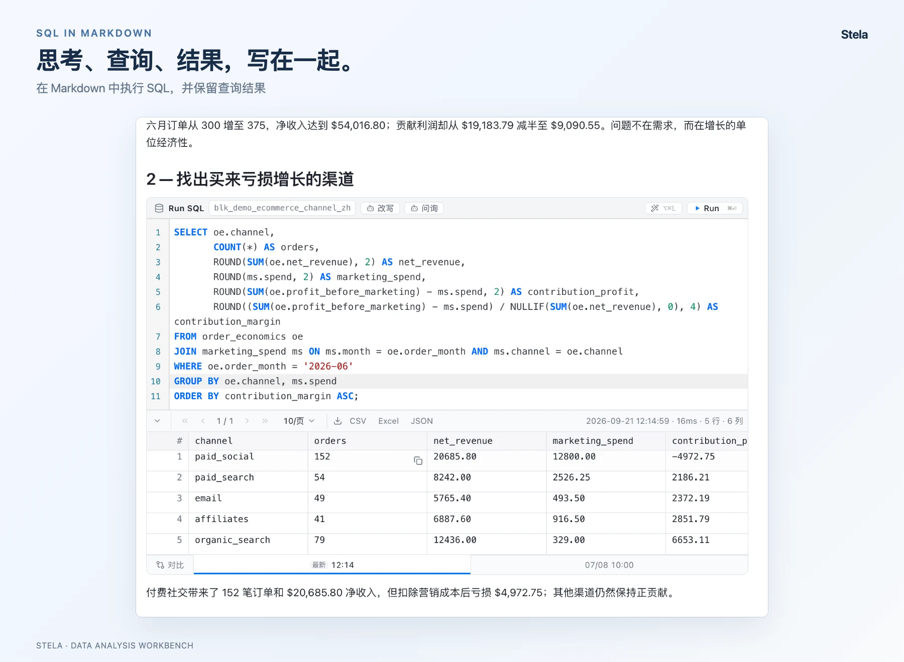](./docs/assets/screenshots/zh-markdown.png)

### SQL in Chat

**一个输入框，既写 SQL，也向 AI 提问。** 可直接执行的 SQL 返回结果表格；自然语言、SQL 与文字混合的输入交给 Agent 理解和处理。遇到查询问题，可以让 Agent 修正 SQL，继续分析。

在同一段对话里追问数据、生成分析图表或流程图。通过 @ 引用笔记、Canvas 和 SQL 块，把已有工作带入对话。

> SQL Chat 为开发版预览，下载版本的功能以 Releases 为准。

[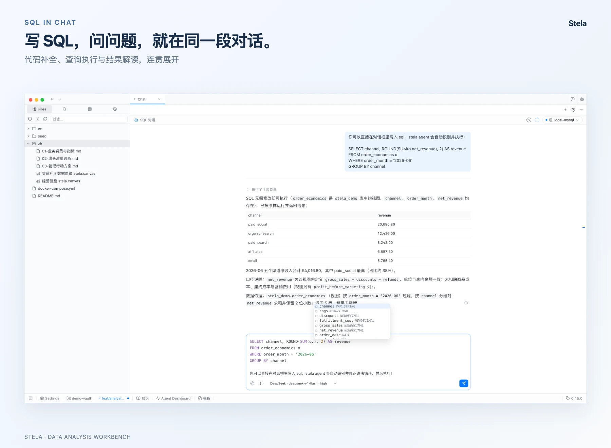](./docs/assets/screenshots/zh-chat.png)

### Data Agent

**让 Agent 实际操作数据，完成多步骤分析。** Stela 的 Agent 基于 Pi。给它一个分析任务，它可以查找表结构和业务笔记，编写并执行 SQL，使用 Python 计算，再根据结果继续调查。

工具调用、SQL 和结果都可以查看。你可以继续追问、调整查询，或让它把结论整理到笔记和 Canvas 中。Agent Panel 可以在当前文档旁打开。

[基于 Pi 构建](https://github.com/earendil-works/pi)

[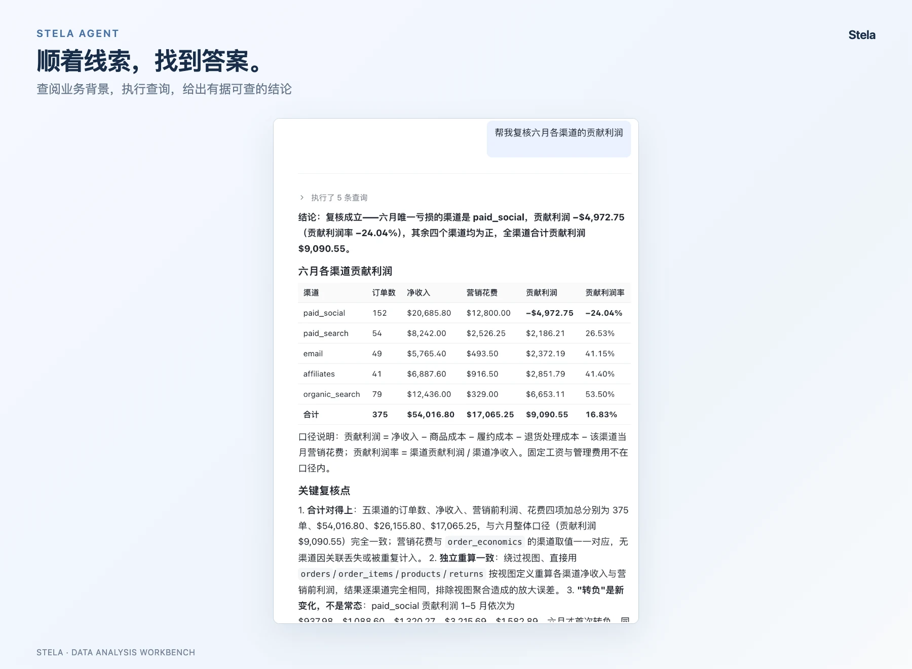](./docs/assets/screenshots/zh-agent.png)

### Canvas

**把图表、表格和结论放到一张分析画布中。** Canvas 可以组合指标、图表、结果表格、文字和流程图。让 Agent 创建画布后，你可以继续编辑内容，保留底层查询，并刷新数据。

分析不只是一条对话回复：Canvas 会保存为独立文件，可以再次打开，也可以导出 HTML 分享。

[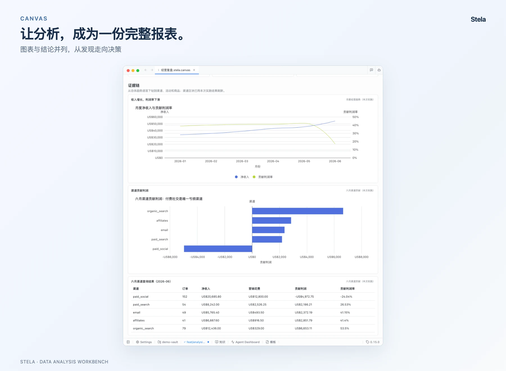](./docs/assets/screenshots/zh-canvas.png)

[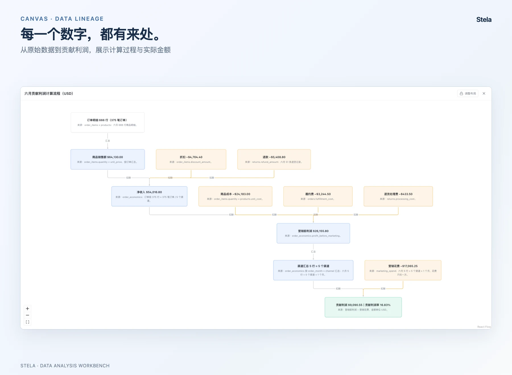](./docs/assets/screenshots/zh-lineage.png)

### 笔记与自动知识维护

**记录你做过的分析，让 Agent 逐渐理解你的业务。** Stela 也是笔记软件。脚本、查询、对话和分析记录保存在 Vault 中；自动知识维护从这些记录中整理有依据、可复用的经验，例如指标口径、表之间的关系和查询方法。

后续分析时，Agent 可以查找并使用这些知识，减少你反复解释同一套业务背景。知识保存在可读、可编辑的文件中，你可以检查和修改。

[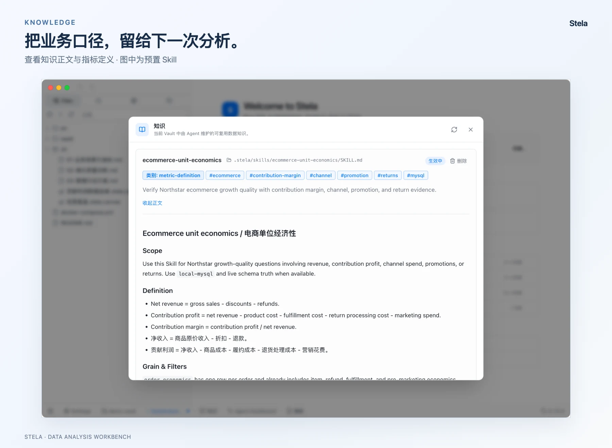](./docs/assets/screenshots/zh-knowledge.png)

### 插件化数据库连接

**统一管理连接，通过插件扩展数据源。** 在设置中安装连接器插件，配置、测试和管理数据库连接。Markdown、Chat 和 Agent 使用这些连接访问数据。

当前发布配置包含 MySQL、PostgreSQL 和 HTTP 连接器示例。需要其他数据源时，可以开发自己的连接器插件。

[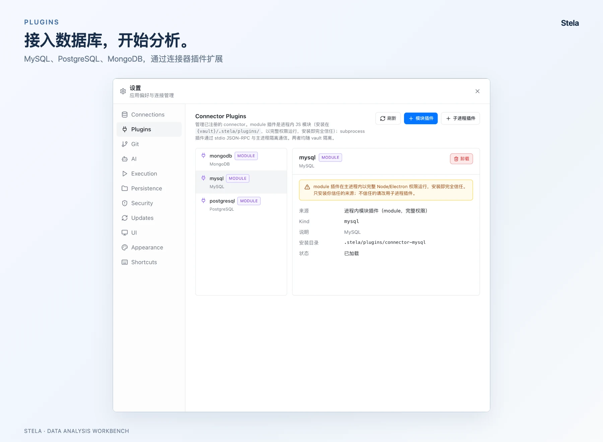](./docs/assets/screenshots/zh-plugins.png)

### Local-first

**工作文件保存在你自己的文件夹里。** Vault 就是本地工作文件夹。Markdown 笔记、Chat、Canvas 和执行记录都保存在其中，可以备份、迁移，并通过 Git 管理版本。

SQL 在你连接的数据库上执行。使用 AI 时，相关上下文会发送到你配置的模型服务；不启用 AI 也能使用笔记和 SQL。

[](./docs/assets/product/local.png)

## 开始使用

1. 下载 Stela，打开或创建一个 Vault。
2. 安装数据库连接器插件，在设置中配置连接。
3. 在 Markdown 中添加 runsql 块，编写并运行 SQL。
4. 配置模型服务，即可让 Agent 分析数据、生成图表和 Canvas。

[先浏览 Demo Vault](./examples/demo-vault/README.md) — 包含可直接打开的笔记、已保存结果和 Canvas。

## 开发与贡献

Stela 使用 Electron、React 和 TypeScript。欢迎报告问题、改进功能或开发连接器插件。

```bash
git clone https://github.com/ay27/Stela.git
cd Stela
npm install
npm run dev
```

[Architecture](./docs/ARCHITECTURE.md) · [Abstractions](./docs/ABSTRACTIONS.md) · [ADRs](./docs/adr/) · [Keyboard shortcuts](./docs/keybindings.md)

`npm install` 会启用提交前检查。`npm run check:precommit` 运行测试、公开发布检查与生产构建；构建包含 Renderer 类型及 Electron 符号／导入检查，主进程严格类型诊断通过 `npm run check:main-types` 单独检查。
