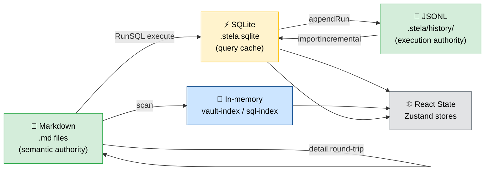
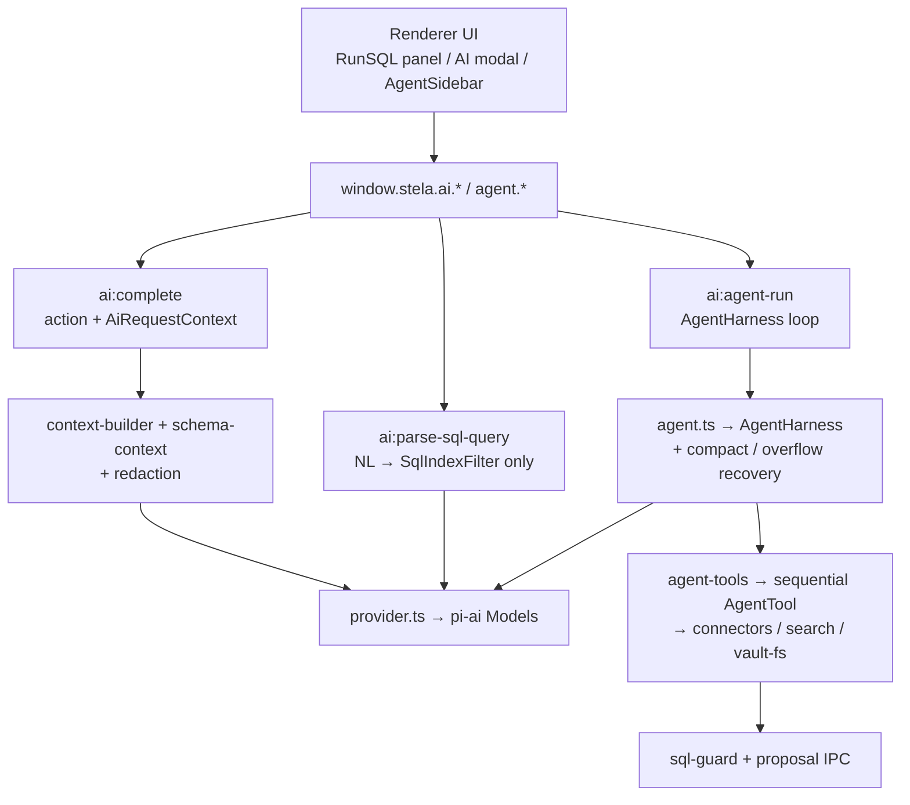

# Architecture

Stela is a local-first desktop app for SQL data notes. Users write Markdown, run SQL where the data question appears, keep every execution traceable, and turn a folder of notes into a lightweight data workspace.

## Design Principles

### Markdown as the semantic layer

Stela notes are plain `.md` files with YAML frontmatter, `runsql` fenced code blocks, and `<detail>` HTML summaries. The app never owns the prose — it only reads and writes files. Any tool that understands Markdown (VS Code, GitHub, Obsidian) can open a Stela vault without Stela installed. `runsql` blocks degrade to ordinary code blocks in those viewers.

### Two authorities, three disposable layers

SQL result sets are too large to live in Markdown. Stela therefore has **two authoritative stores** and **three disposable caches**:

| Layer | Location | Authority | Role |
|-------|----------|-----------|------|
| Semantic | `{vault}/**/*.md` | **Authoritative** | Prose, SQL, `<detail>` summaries, `connection_name` |
| Execution history | `{vault}/.stela/history/history_{deviceSlug}.jsonl` | **Authoritative** | Append-only run packages; Git-synced, per-device write isolation |
| Result cache | `{vault}/.stela.sqlite` | Disposable | Query cache (`runs` / `result_schemas` / `result_rows`); rebuildable from JSONL |
| Vault config | `{vault}/.stela/*.json` | Authoritative | Settings, connections, plugin manifests |
| Session state | Zustand + localStorage + `{userData}/` | Disposable | Panel widths, open tabs, recent vaults |

When in doubt: **Markdown + JSONL win**. SQLite, in-memory indexes, and React state must be reconstructible by deleting them.



#### Invariants

1. **Write order on success**: SQLite cache → JSONL append → `<detail>` write-back to Markdown (via editor autosave).
2. **`<detail>` is a summary only**: readable metadata + `result-ref-id`; full result rows live in SQLite/JSONL.
3. **Per-device JSONL**: each machine appends only to its own `history_{slug}.jsonl`; Git merges without line conflicts.
4. **SQLite never enters Git**: `.stela.sqlite*` is gitignored; cross-device sync relies on Markdown + JSONL.
5. **Disk-first for vault writes**: all vault mutations go through main-process services with `ensureWithinVault` before updating renderer state.

### Vault vs. machine settings

When deciding where to persist data, ask: **"Should this follow the vault across devices, or stay with this installation?"**

| Follows the vault | Stays with the installation |
|-------------------|-----------------------------|
| `.stela/settings.json` (appearance, execution, git, AI prefs) | `{userData}/stela-cache.json` (last vault, recent vaults, locale) |
| `.stela/connections.json` (connection definitions) | `{userData}/device-profile.json` (deviceId + slug for JSONL filename) |
| `.stela/secrets/secrets_{slug}.json` (safeStorage-wrapped DB passwords) | Panel widths, open tabs, transient UI state |
| `.stela/secrets/ai_{slug}.json` (safeStorage-wrapped AI API key) | Agent in-memory `sessionId` chat history |
| `.stela/connector_plugins.json` + `.stela/plugins/` | Command palette transient input |
| Markdown frontmatter `connection_name` | Dev-mode isolated userData (`Stela-dev`) |

Passwords are stored per-device in `secrets_{slug}.json` (Git-synced ciphertext, decryptable only on the originating machine via `safeStorage`).

### Convention over configuration

Stela is opinionated about the data-note shape:

- `type: stela-data-note` in frontmatter marks a data note
- `connection_name:` selects the default database connection for the file
- `` ```runsql `` fences mark executable SQL blocks
- `<detail>` immediately follows each executed `runsql` block
- `[[wikilinks]]` connect notes into a navigable analysis graph

These conventions make vaults legible to humans and to AI agents without per-user custom configuration.

### Electron security boundary

The renderer has **no Node privileges**. All desktop capabilities flow through a typed preload bridge (`window.stela.*`). Main process validates every IPC input with Zod; vault path writes pass `ensureWithinVault`. See [ADR-0004](./adr/0004-electron-ipc-security-model.md).

## Tech Stack

| Layer | Technology | Version |
|-------|-----------|---------|
| Desktop shell | Electron | 41.5 |
| Frontend | React + TypeScript | React 18, TS 5.6 |
| Markdown editor | Milkdown 7 (Crepe preset) + ProseMirror | 7.20 |
| SQL editing | CodeMirror 6 (`@codemirror/lang-sql`) | 6.x |
| RunSQL NodeView | Custom ProseMirror NodeView | `src/editor/runsql/` |
| Styling | Tailwind CSS 3 + shadcn/ui (Radix) | — |
| State | Zustand | 5.x |
| Local DB | better-sqlite3 (main process) | 12.x |
| Build | electron-vite + Vite | 5.x |
| IPC validation | Zod | 3.x |
| i18n | i18next | zh / en |
| Packaging | electron-builder | mac dmg/zip, win nsis, linux AppImage/deb |
| Auto-update | electron-updater | GitHub Releases (macOS zip, Windows NSIS) |

**Historical note:** Stela began as an Obsidian plugin, then a Tauri/Rust prototype. The open-source release is **Electron-only**; legacy code is not part of the runtime.

## Process Model

```
┌──────────────────────────────────────────────────────────────┐
│ Renderer (src/)                                              │
│   React + Milkdown + CodeMirror + Zustand                    │
│   Calls window.stela.* only — no Node access                 │
└──────────────────────┬───────────────────────────────────────┘
                       │ contextBridge (typed, per-capability)
┌──────────────────────▼───────────────────────────────────────┐
│ Preload (electron/preload/index.ts)                          │
│   exposeInMainWorld("stela", { vault, storage, connector… }) │
│   No generic invoke(channel, args)                           │
└──────────────────────┬───────────────────────────────────────┘
                       │ ipcMain.handle + Zod schema
┌──────────────────────▼───────────────────────────────────────┐
│ Main (electron/main/)                                        │
│   index.ts, handlers.ts, ipc-router.ts, vault-context.ts     │
│   security.ts (CSP, navigation guards)                       │
└──────────────────────┬───────────────────────────────────────┘
                       │ direct service calls
┌──────────────────────▼───────────────────────────────────────┐
│ Services (electron/services/)                                │
│   vault-fs, result-store, history-journal, connectors, git,  │
│   vault-index, sql-index, ai, search, settings, secrets      │
└──────────────────────────────────────────────────────────────┘
```

### Vault lifecycle

`electron/main/vault-context.ts` owns the current vault singleton. `setCurrentVault(path)` runs a fixed sequence:

1. Seed legacy userData config if `.stela/` is missing
2. Seed bundled connector plugins (MySQL, PostgreSQL, HTTP sample)
3. Ensure `.gitignore` covers SQLite and local-only files
4. Shutdown old connector subprocesses; load new vault's plugin registry
5. Open SQLite cache and incrementally import JSONL history
6. Start vault watcher, rebuild vault-index and sql-index
7. Broadcast `vault:external-change` / `index:changed` events to renderer

Renderer triggers this via `window.stela.vault.setCurrent(path)`.

## Editor Stack

### Milkdown + RunSQL

Stela uses Milkdown 7 with the Crepe preset for WYSIWYG Markdown editing. Crepe's built-in CodeMirror feature is **disabled** — Stela implements its own `CodeBlockNodeView` for both ordinary code blocks and `runsql` blocks.

```
Note file on disk (.md)
   │ readFile
   ▼
splitFrontmatter(raw) → { frontmatter, body }
   │ normalize <detail> spacing for remark-parse
   ▼
Milkdown commonmark + gfm
   │ remark-detail-merge: <detail> html → code node attrs
   ▼
ProseMirror doc
   │ CodeBlockNodeView (language === "runsql")
   ▼
RunSQL UI: connection badge + CM6 editor + Run button + BlockResult

———————— user edits ————————

ProseMirror doc
   │ markdownUpdated (debounced)
   ▼
remark-stringify → body
   ▼
joinFrontmatter → writeFile
```

Key files:

| File | Role |
|------|------|
| `src/editor/MilkdownEditor.tsx` | React entry, Crepe setup, autosave listener |
| `src/editor/runsql/stela-codeblock-schema.ts` | Extended codeBlock schema (`detail`, `detailRaw`, `blockId`) |
| `src/editor/runsql/remark-detail-merge.ts` | mdast-layer `<detail>` absorption |
| `src/editor/runsql/codeblock-nodeview.ts` | RunSQL UI + embedded BlockResult |
| `src/editor/runsql/execution.ts` | Run button → connector → storage → setNodeMarkup |
| `electron/shared/detail-meta.ts` | Shared `<detail>` parse/serialize (main + renderer) |
| `electron/shared/runsql-fences.ts` | Shared fence detection for indexing |

### Wiki links

`src/editor/wiki/` provides `[[wikilink]]` autocomplete and navigation. `electron/services/vault-index.ts` maintains an in-memory backlink/outgoing-link graph, rebuilt on vault open and incrementally updated by the watcher.

## RunSQL Execution Flow

```
User clicks Run (CodeBlockNodeView)
    │
    ▼
execution.ts runBlock()
    ├── ensure blockId on node attrs
    ├── read sql from CM6 editor
    ├── resolve connection from frontmatter connection_name
    ├── setNodeMarkup({ runState: "running" })  ← transient, not in markdown
    ├── connectorRegistry.execute(kind, config, sql)
    │       └── sends SQL unchanged; caps returned rows by execution.maxRows
    ├── runId = uuid()
    ├── storage.saveRun / saveSchema / saveRows
    ├── historyJournal.appendRun()  → JSONL
    ├── serializeDetail(meta) → setNodeMarkup({ detail, detailRaw })
    │       └── triggers Milkdown autosave → disk
    └── BlockResult fetches schema + page via storage.queryPage
```

On failure: `runState: "error"`, no `<detail>` write (preserves round-trip integrity). Failed runs still record a `status: "err"` RunRecord for Run History.

## Connector Architecture

All database access goes through a **plugin registry** (`electron/services/connectors/registry.ts`). The core ships no in-process connectors — only bundled module plugins:

| Plugin | Type | Location |
|--------|------|----------|
| MySQL | module | `plugins/connector-mysql/` |
| PostgreSQL | module | `plugins/connector-postgresql/` |
| HTTP sample | module | `plugins/connector-http-sample/` |

Two plugin tracks coexist:

| Track | Runtime | Trust | Use case |
|-------|---------|-------|----------|
| **module** | In-process JS (`createRequire`) | Full Node permissions | Official bundled connectors |
| **subprocess** | stdio JSON-RPC child process | Process isolation | Third-party / arbitrary-language connectors |

Registration:

- Module plugins: `{vault}/.stela/plugins/<id>/` with `plugin.json` + built entry
- Subprocess plugins: `{vault}/.stela/connector_plugins.json` with `exe_path`

See [ADR-0005](./adr/0005-connector-plugin-dual-track.md).

## Git Sync

Stela replaces the earlier COS object-storage sync model with **Git-native vault sync**:

- Notes (`.md`) and execution history (`.jsonl`) are tracked
- `.stela.sqlite*` and `recent-files.local.json` are gitignored
- `electron/services/sync-orchestrator.ts` coordinates pull → JSONL import → index refresh
- `electron/services/git/` provides status, commit, push, pull, conflict handling
- AutoGit (`src/services/auto-git.ts`) checkpoints on idle/inactive

See [ADR-0007](./adr/0007-git-sync-over-cloud-storage.md).

## Search

Two independent search paths:

| Capability | Shortcut | Backend | UI |
|------------|----------|---------|-----|
| Vault full-text search | `Mod+Shift+F` | `electron/services/search.ts` (line-level substring) | `SearchPanel.tsx` |
| SQL structured search | Sidebar | `electron/services/sql-index.ts` (AST fact extraction) | `SqlSearchView.tsx` |
| Find in current file | `Mod+F` / `Mod+Alt+F` | ProseMirror `doc.descendants` + CM bridge | `find-in-file/` |

Editor reveal from search hits uses `src/editor/search/` (source-map + locator + reveal) to map file line numbers to ProseMirror positions.

## AI

Stela AI is **search-first and provider-backed**, not on-device RAG. Retrieval uses vault search, sql-index, connector schema introspection, and optional redacted result samples. Embeddings / MCP / `.stela-knowledge.sqlite` are out of the open-source tree ([ADR-0008](./adr/0008-search-first-ai-instead-of-rag.md)).

### Provider & secrets

| Concern | Implementation |
|---------|----------------|
| Chat / agent transport | `@earendil-works/pi-ai` custom OpenAI-compatible provider (`completeSimple` / AgentHarness streams) |
| Agent loop | `@earendil-works/pi-agent-core` `AgentHarness` + in-memory `Session` |
| API key | `{vault}/.stela/secrets/ai_{deviceSlug}.json` via `safeStorage` (injected into pi `CredentialStore`; not pi `auth.json`) |
| Settings | vault `.stela/settings.json` → `ai.*` (`hasApiKey` only, never the key; `contextWindow` presets for compaction) |

No cloud FIM / ghost-text inline completion — removed for latency ([ADR-0018](./adr/0018-pi-ai-agent-harness.md) supersedes [ADR-0015](./adr/0015-openai-compatible-provider-without-fim.md) / [ADR-0011](./adr/0011-openai-compatible-provider-and-fim.md)). RunSQL still has local schema/keyword autocomplete.

### Two surfaces (+ one translator)



1. **Action complete** — one-shot `AiActionKind` (rewrite-sql, ask-sql, explain-result, explain-table, …). Prompt assembled in main; returns text + optional extracted SQL. UI: RunSQL inline panel, AI modal, schema browser actions. ([ADR-0018](./adr/0018-pi-ai-agent-harness.md))
2. **Harness agent** — `AgentHarness` tool loop with streaming `ai:agent-event`. Tools browse schema, run SQL, search/read notes, propose edits. Mutations and note writes wait for user approve. Agent chat accepts `@table` mentions, `[[note]]` references, a default current-note reference, and Add to Chat content attachments. Runs continue until the model finishes, errors, or the user cancels. Compacts when near `ai.contextWindow` budget and once on provider context overflow; Panel shows approximate usage + compacting status. ([ADR-0013](./adr/0013-agent-tools-sql-guard-and-proposals.md), [ADR-0016](./adr/0016-agent-chat-references-and-add-to-chat.md), [ADR-0017](./adr/0017-user-cancelled-agent-runs.md), [ADR-0018](./adr/0018-pi-ai-agent-harness.md))
3. **SQL query parse** — model only emits a `SqlIndexFilter`; hits always come from deterministic `sql-index`.

### Context pipeline

Before any action prompt leaves the machine ([ADR-0014](./adr/0014-ai-context-redaction-and-schema-enrichment.md)):

1. Enrich connector dialect + schema targets from SQL symbols and `@table` mentions
2. Cap note / SQL / DDL / sample sizes
3. Attach result samples only if `sendResultSamples` (capped by `maxSampleRows`)
4. `redactForPrompt` strips secret-shaped keys/values
5. Action-specific instructions from `prompt-builder.ts`

### Agent safety

- Read-only SQL runs immediately; core execution caps saved/displayed result rows without rewriting SQL
- Multi-statement SQL blocked
- Mutations require `agentAllowMutations` **and** `ai:agent-respond-proposal`
- `propose_edit` never writes until approved
- Agent runs are stopped by model completion, errors, or explicit user cancellation; legacy iteration/time settings are ignored
- Session history is in-memory `Session` / `InMemorySessionStorage` by `sessionId` (not persisted)
- Compaction: proactive `shouldCompact` against `ai.contextWindow`, plus one overflow recovery compact + continue; additive `context_usage` / `compaction` events on `ai:agent-event`
- Agent chat references are structured: note paths are listed for tool-driven `read_note`, while selected prose and RunSQL snippets are added to the current user turn with a bounded character budget

### Key files

| Path | Role |
|------|------|
| `electron/services/ai/provider.ts` | API key shards, pi-ai Models / OpenAI-compatible transport |
| `electron/services/ai/index.ts` | complete / parseSqlQuery entry |
| `electron/services/ai/context-builder.ts` | bounded context + related runs |
| `electron/services/ai/schema-context.ts` | table/DDL enrichment |
| `electron/services/ai/prompt-builder.ts` | action prompts |
| `electron/services/ai/redaction.ts` | secret scrubbing |
| `electron/services/ai/agent.ts` | AgentHarness + session memory + compaction |
| `electron/services/ai/agent-tools.ts` | sequential AgentTool wrappers + dispatch |
| `electron/services/ai/sql-guard.ts` | read-only vs mutation classification |
| `src/components/ai/` | modal, inline panel, agent panel, `@table` / `[[note]]` input, Add to Chat |

## IPC Contract

### Invoke channels (bidirectional, Zod-validated)

- Constants: `electron/shared/ipc-channels.ts` (`domain:action` naming)
- Schemas: `electron/shared/ipc-schema.ts`
- Router: `electron/main/ipc-router.ts` (validate → execute → normalize errors)
- Errors: `AppError` → `{ code, message, retryable }` plain object

### Event channels (main → renderer, push-only)

- `electron/shared/ipc-events.ts`
- `vault:external-change`, `index:changed`, `sql-index:changed`, `ai:agent-event`

### Preload API shape

```text
window.stela.vault.*        — FS, setCurrent, attachments, onExternalChange
window.stela.dialog.*       — pick vault / directory / file
window.stela.settings.*       — load / patch AppSettings
window.stela.connections.*    — CRUD connection map
window.stela.storage.*        — SQLite run store
window.stela.connector.*      — execute + plugin management
window.stela.search.*         — vault search + file list
window.stela.git.*            — Git operations
window.stela.journal.*          — JSONL history import/export
window.stela.ai.* / agent.*   — completion, agent harness
window.stela.index.*          — vault wiki index
window.stela.sqlIndex.*       — SQL fact index
window.stela.export.*         — export markdown with results
window.stela.updater.*        — auto-update check
```

Types: `src/types/stela-bridge.d.ts` (renderer), `electron/shared/types.ts` (shared DTOs).

## Directory Structure

```
electron/
├── main/           # Entry, window, IPC handlers, vault-context, security
├── preload/        # contextBridge → window.stela
├── shared/         # IPC channels/schema/events, DTO types, detail-meta, runsql-fences
└── services/       # All main-process business logic
    ├── vault-fs.ts, result-store.ts, history-journal.ts
    ├── connectors/ (registry, module-loader, subprocess, bundled-plugins)
    ├── git/, ai/, vault-index.ts, sql-index.ts, vault-watcher.ts
    └── settings-store.ts, connections-store.ts, secrets.ts

src/
├── contracts/      # Renderer-facing interfaces (IStorage, IConnectorRegistry, AppSettings)
├── services/       # Thin adapters over window.stela.*
├── state/          # Zustand stores
├── editor/         # Milkdown, runsql, wiki, find-in-file, search, mermaid
├── layout/         # AppShell, Sidebar, TabBar, FileTree, panels
├── views/          # EditorView, WelcomeView
├── components/     # UI, settings tabs, AI panel, export dialog
└── core/           # stela-file.ts, markdown.ts, types.ts

plugins/            # Bundled connector module plugins
plugin-sdk/         # Published SDK for third-party module connectors
examples/demo-vault/ # Public demo vault + docker-compose
docs/               # Architecture docs + product screenshots
```

## Open-Source Scope

`scripts/check-public-release.mjs` enforces what ships in the public repository:

| Included | Excluded |
|----------|----------|
| Electron desktop app | Tauri/Rust backend |
| Git + JSONL sync | COS object storage |
| Search-first AI | RAG embeddings (onnxruntime, transformers.js) |
| Bundled MySQL/PostgreSQL/HTTP connectors | Private connector plugins |
| Wiki links + SQL index | MCP server child process |
| Module + subprocess connector framework | Obsidian plugin runtime |

Forbidden-text scanning:

- **In-repo:** only generic API-key leak shapes.
- **Private identifiers:** `STELA_RELEASE_FORBIDDEN_PATTERNS` env (CI → GitHub Secret)
  and/or gitignored `scripts/internal/release-gate.local.json`. See [ADR-0019](./adr/0019-private-release-gate-patterns-via-secret.md).


## Related Documents

- [ABSTRACTIONS.md](./ABSTRACTIONS.md) — domain models and interface contracts
- [adr/](./adr/) — architecture decision records
- [../AGENTS.md](../AGENTS.md) — agent workflow: read docs before edits, ADR/docs gate after structural changes
- [../.cursor/skills/create-adr/SKILL.md](../.cursor/skills/create-adr/SKILL.md) — create/supersede ADR checklist
- [../README.md](../README.md) — product overview (bilingual)
- [../examples/demo-vault/README.md](../examples/demo-vault/README.md) — demo setup
