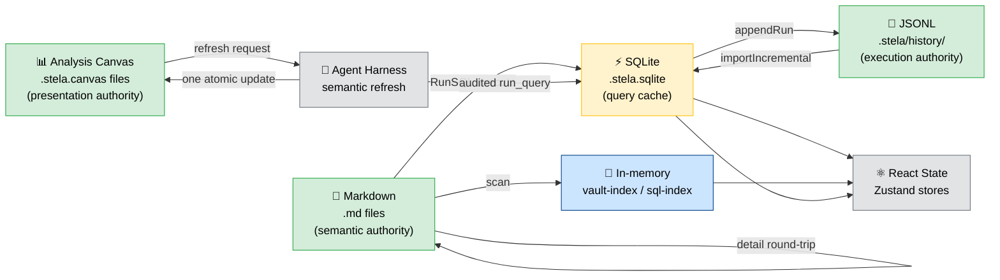
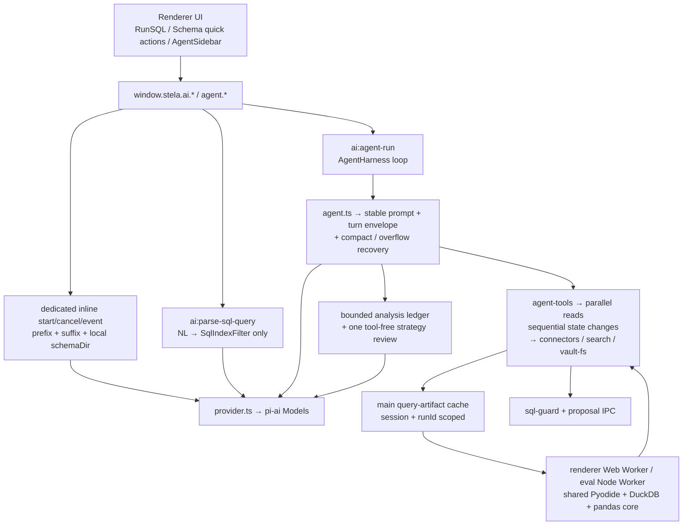

# Architecture

Stela is a local-first desktop app for SQL data notes. Users write Markdown, run SQL where the data question appears, keep every execution traceable, and turn a folder of notes into a lightweight data workspace.

## Design Principles

### Markdown as the semantic layer

Stela notes are plain `.md` files with YAML frontmatter, `runsql` fenced code blocks, and `<detail>` HTML summaries. The app never owns the prose — it only reads and writes files. Any tool that understands Markdown (VS Code, GitHub, Obsidian) can open a Stela vault without Stela installed. `runsql` blocks degrade to ordinary code blocks in those viewers.

### Four authority categories, four disposable layers

SQL result sets, Agent sessions, and local Agent traces are too large to live in Markdown. Stela therefore groups durable data into **four authority categories** beside **four disposable layers**:

| Layer | Location | Authority | Role |
|-------|----------|-----------|------|
| Semantic | `{vault}/**/*.md`, `{vault}/**/*.stela.canvas` | **Authoritative** | Notes plus structured analysis presentations; both are Git-trackable Vault files |
| Execution history | `{vault}/.stela/history/history_{deviceSlug}.jsonl` | **Authoritative** | Append-only run packages; Git-synced, per-device write isolation |
| Result cache | `{vault}/.stela.sqlite` | Disposable | Query cache (`runs` / `result_schemas` / `result_rows`); rebuildable from JSONL |
| Vault config | `{vault}/.stela/*.json` | Authoritative | Settings, connections, plugin manifests |
| Agent session history | `{vault}/.stela/agent-history/<deviceSlug>/*.jsonl` | **Authoritative** | pi AgentHarness context and Agent Panel timeline; newest 20 per device |
| Local Agent observability | `{vault}/.stela/agent-metrics.local.sqlite` | **Authoritative (local, 90 days)** | AI/Agent runs, tool events, Skill usage, maintenance outcomes, redacted traces |
| Agent query artifacts | `{userData}/query-artifacts/` | Disposable | Session-scoped Parquet/JSONL inputs for local `execute_python`; never synced or exposed by path |
| Session state | Zustand + localStorage + `{userData}/` | Disposable | Panel widths, open tabs, recent vaults |

Vault source files + JSONL win for synced product data. `.stela.sqlite` remains disposable; the separately named `agent-metrics.local.sqlite` is a bounded machine-local observability authority and is never used for note or execution recovery.


```mermaid
flowchart LR
    MD["📝 Markdown\n.md files\n(semantic authority)"]
    CANVAS["📊 Analysis Canvas\n.stela.canvas files\n(presentation authority)"]
    JSONL["📜 JSONL\n.stela/history/\n(execution authority)"]
    SQL["⚡ SQLite\n.stela.sqlite\n(query cache)"]
    IDX["🧠 In-memory\nvault-index / sql-index"]
    UI["⚛️ React State\nZustand stores"]
    AGENT["🤖 Agent Harness\nsemantic refresh"]

    MD -->|"RunSQL execute"| SQL
    CANVAS -->|"refresh request"| AGENT
    AGENT -->|"audited run_query"| SQL
    AGENT -->|"one atomic update"| CANVAS
    SQL -->|"appendRun"| JSONL
    MD -->|"detail round-trip"| MD
    JSONL -->|"importIncremental"| SQL
    MD -->|"scan"| IDX
    SQL --> UI
    IDX --> UI
    SQL --> UI

    style MD fill:#d4edda,stroke:#28a745,color:#000
    style CANVAS fill:#d4edda,stroke:#28a745,color:#000
    style JSONL fill:#d4edda,stroke:#28a745,color:#000
    style SQL fill:#fff3cd,stroke:#ffc107,color:#000
    style IDX fill:#cce5ff,stroke:#004085,color:#000
    style UI fill:#e2e3e5,stroke:#6c757d,color:#000
    style AGENT fill:#e2e3e5,stroke:#6c757d,color:#000
```

#### Invariants

1. **Write order on success**: SQLite cache → JSONL append → `<detail>` write-back to Markdown (via editor autosave).
2. **`<detail>` is a summary only**: readable metadata + `result-ref-id`; full result rows live in SQLite/JSONL.
3. **Per-device JSONL**: each machine appends only to its own `history_{slug}.jsonl`; Git merges without line conflicts.
4. **SQLite never enters Git**: `.stela.sqlite*` and `.stela/agent-metrics.local.sqlite*` are gitignored; cross-device sync relies on Markdown + JSONL.
5. **Disk-first for vault writes**: all vault mutations go through main-process services with `ensureWithinVault` before updating renderer state.

### Vault vs. machine settings

When deciding where to persist data, ask: **"Should this follow the vault across devices, or stay with this installation?"**

| Follows the vault | Stays with the installation |
|-------------------|-----------------------------|
| `.stela/settings.json` (appearance, execution, git, AI prefs) | `{userData}/stela-cache.json` (last vault, recent vaults, locale) |
| `.stela/connections.json` (connection definitions) | `{userData}/device-profile.json` (deviceId + slug for JSONL filename) |
| `.stela/secrets/secrets_{slug}.json` (safeStorage-wrapped DB passwords) | Panel widths, open tabs, transient UI state |
| `.stela/secrets/ai_{slug}.json` (safeStorage-wrapped AI API key) | Panel widths, open tabs, transient UI state |
| `.stela/agent-history/<deviceSlug>/*.jsonl` | — |
| — | `.stela/agent-metrics.local.sqlite` (90-day AI/Agent metrics and redacted traces) |
| — | `{userData}/query-artifacts/` (bounded disposable Agent compute inputs) |
| `.stela/connector_plugins.json` + `.stela/plugins/` | Command palette transient input |
| `.stela/sql-templates/*.md` (reusable SQL templates) | — |
| `**/*.stela.canvas` (structured analysis presentations) | — |
| Markdown frontmatter `connection_name` | Dev-mode isolated userData (`Stela-dev`) |

Passwords are stored per-device in `secrets_{slug}.json` (Git-synced ciphertext, decryptable only on the originating machine via `safeStorage`).

### Convention over configuration

Stela is opinionated about the data-note shape:

- `type: stela-data-note` in frontmatter marks a data note
- `connection_name:` selects the default database connection for the file
- `` ```runsql `` fences mark executable SQL blocks
- `<detail>` immediately follows each executed `runsql` block
- `[[wikilinks]]` connect notes into a navigable analysis graph

These conventions make vaults legible to humans and to AI agents without per-user custom configuration.

### Electron security boundary

The renderer has **no Node privileges**. All desktop capabilities flow through a typed preload bridge (`window.stela.*`). Main process validates every IPC input with Zod; vault path writes pass `ensureWithinVault`. See [ADR-0004](./adr/0004-electron-ipc-security-model.md).

## Tech Stack

| Layer | Technology | Version |
|-------|-----------|---------|
| Desktop shell | Electron | 41.5 |
| Frontend | React + TypeScript | React 18, TS 5.6 |
| Markdown editor | Milkdown 7 (Crepe preset) + ProseMirror | 7.20 |
| SQL editing | CodeMirror 6 (`@codemirror/lang-sql`) | 6.x |
| RunSQL NodeView | Custom ProseMirror NodeView | `src/editor/runsql/` |
| Styling | Tailwind CSS 3 + shadcn/ui (Radix) | — |
| State | Zustand | 5.x |
| Local DB | better-sqlite3 (main process) | 12.x |
| Build | electron-vite + Vite | 5.x |
| IPC validation | Zod | 3.x |
| i18n | i18next | zh / en |
| Packaging | electron-builder | mac dmg/zip, win nsis, linux AppImage/deb |
| Auto-update | electron-updater | GitHub Releases (macOS zip, Windows NSIS) |

**Historical note:** Stela began as an Obsidian plugin, then a Tauri/Rust prototype. The open-source release is **Electron-only**; legacy code is not part of the runtime.

## Process Model

```
┌──────────────────────────────────────────────────────────────┐
│ Renderer (src/)                                              │
│   React + Milkdown + CodeMirror + Zustand                    │
│   Calls window.stela.* only — no Node access                 │
└──────────────────────┬───────────────────────────────────────┘
                       │ contextBridge (typed, per-capability)
┌──────────────────────▼───────────────────────────────────────┐
│ Preload (electron/preload/index.ts)                          │
│   exposeInMainWorld("stela", { vault, storage, connector… }) │
│   No generic invoke(channel, args)                           │
└──────────────────────┬───────────────────────────────────────┘
                       │ ipcMain.handle + Zod schema
┌──────────────────────▼───────────────────────────────────────┐
│ Main (electron/main/)                                        │
│   index.ts, handlers.ts, ipc-router.ts, vault-context.ts     │
│   security.ts (CSP, navigation guards)                       │
└──────────────────────┬───────────────────────────────────────┘
                       │ direct service calls
┌──────────────────────▼───────────────────────────────────────┐
│ Services (electron/services/)                                │
│   vault-fs, result-store, history-journal, connectors, git,  │
│   vault-index, sql-index, ai, search, settings, secrets      │
└──────────────────────────────────────────────────────────────┘
```

### Vault lifecycle

`electron/main/vault-context.ts` owns the current vault singleton. `setCurrentVault(path)` runs a fixed sequence:

1. Seed legacy userData config if `.stela/` is missing
2. Seed bundled connector plugins (MySQL, PostgreSQL, MongoDB, HTTP sample)
3. Ensure `.gitignore` covers SQLite and local-only files
4. Shutdown old connector subprocesses; load new vault's plugin registry
5. Open SQLite cache and incrementally import JSONL history
6. Start the `@parcel/watcher` native recursive vault watcher, rebuild vault-index and sql-index
7. Broadcast `vault:external-change` / `index:changed` events to renderer

Renderer triggers this via `window.stela.vault.setCurrent(path)`.

## Editor Stack

### Milkdown + RunSQL

Stela uses Milkdown 7 with the Crepe preset for WYSIWYG Markdown editing. Crepe's built-in CodeMirror feature is **disabled** — Stela implements its own `CodeBlockNodeView` for both ordinary code blocks and `runsql` blocks.

```
Note file on disk (.md)
   │ readFile
   ▼
splitFrontmatter(raw) → { frontmatter, body }
   │ normalize <detail> spacing for remark-parse
   ▼
Milkdown commonmark + gfm
   │ remark-detail-merge: <detail> html → code node attrs
   ▼
ProseMirror doc
   │ CodeBlockNodeView (language === "runsql")
   ▼
RunSQL UI: connection badge + CM6 editor + Run button + BlockResult

———————— user edits ————————

ProseMirror doc
   │ markdownUpdated (debounced)
   ▼
remark-stringify → body
   ▼
joinFrontmatter → writeFile
```

Key files:

| File | Role |
|------|------|
| `src/editor/MilkdownEditor.tsx` | React entry, Crepe setup, autosave listener |
| `src/editor/runsql/stela-codeblock-schema.ts` | Extended codeBlock schema (`detail`, `detailRaw`, `blockId`) |
| `src/editor/runsql/remark-detail-merge.ts` | mdast-layer `<detail>` absorption |
| `src/editor/runsql/codeblock-nodeview.ts` | RunSQL UI + embedded BlockResult |
| `src/editor/runsql/execution.ts` | Run button → connector → storage → setNodeMarkup |
| `electron/shared/detail-meta.ts` | Shared `<detail>` parse/serialize (main + renderer) |
| `electron/shared/runsql-fences.ts` | Shared fence detection for indexing |

### Wiki links

`src/editor/wiki/` provides `[[wikilink]]` autocomplete and navigation. `electron/services/vault-index.ts` maintains an in-memory backlink/outgoing-link graph, rebuilt on vault open and incrementally updated by the watcher.

## RunSQL Execution Flow

```
User clicks Run (CodeBlockNodeView)
    │
    ▼
execution.ts runBlock()
    ├── ensure blockId on node attrs
    ├── read sql from CM6 editor
    ├── resolve connection from frontmatter connection_name
    ├── setNodeMarkup({ runState: "running" })  ← transient, not in markdown
    ├── connectorRegistry.execute(kind, config, sql)
    │       └── sends SQL unchanged; caps returned rows by execution.maxRows
    ├── runId = uuid()
    ├── storage.saveRun / saveSchema / saveRows
    ├── historyJournal.appendRun()  → JSONL
    ├── serializeDetail(meta) → setNodeMarkup({ detail, detailRaw })
    │       └── triggers Milkdown autosave → disk
    └── BlockResult fetches schema + page via storage.queryPage
```

On failure: `runState: "error"`, no `<detail>` write (preserves round-trip integrity). Failed runs still record a `status: "err"` RunRecord for Run History.

## Analytical Chart and Canvas Flow

`electron/shared/chart-spec.ts` defines Stela's versioned `preset + semantic
fields + mark/encoding` chart contract rather than rows, transforms, or
executable ECharts configuration. It covers trend, ranking, composition,
distribution, correlation, funnel, retention, comparison, and bounded custom
views; compatible bar/line/area/point/rule marks may use two shared-x layers.
Stela validates the contract and compiles it locally to ECharts. A simple Agent
chart binds to the exact `runId` returned by SQL `run_query` and renders only in the
Agent timeline. Charts are not a Markdown or RunSQL abstraction.

Long or multi-stage analyses use a normal Vault file named `*.stela.canvas`.
`electron/shared/analysis-canvas.ts` validates embedded read-only SQL sources,
sections, and `markdown | kpi | chart | table | flow` cards. Data-backed cards
bind to a source id; the source points to its latest audited run, while result
rows stay in the same SQLite/JSONL stores used by RunSQL. KPI, table, and chart
fields share one strict display-format contract. The renderer loads snapshots
and lazily mounts ECharts with its SVG renderer. Source-free controlled Flow
cards use the same natural-size, scrollable scene geometry as HTML export for
their inline read view; the expanded layout editor mounts React Flow for
zooming, panning, and optional node adjustment. Canvas Markdown does not execute Mermaid.

Canvas creation, reads, and Flow layout updates cross dedicated typed IPC
methods. Whole-Canvas and single-source refresh actions instead start a
dedicated Agent run with typed target metadata. The update tool permits that run
one atomic commit only after every targeted current source is rebound to a
successful audited query from the same run. The Agent re-evaluates affected
KPI, chart, table, Markdown, and Flow semantics; an unresolved target failure
leaves the Canvas unchanged while query and Agent histories retain the failure.
Writes remain path-confined, atomic, and etag-protected. Standalone HTML export
embeds the current result data, Stela-compiled chart options, and an offline
ECharts runtime so charts retain tooltip, legend, hover, and responsive resize
behavior. Tables and Flow diagrams are frozen snapshots, and collapsed source
SQL remains inspectable without any runtime execution bridge or network
dependency. A user may drag Flow nodes or request deterministic
Dagre TB/LR auto-layout; the etag-protected layout write changes only direction
and existing node coordinates. Agent updates preserve that user-owned layout by
stable ids. See [ADR-0056](./adr/0056-user-adjustable-react-flow-cards.md) and
[ADR-0057](./adr/0057-bounded-mark-encoding-visualizations.md), plus
[ADR-0070](./adr/0070-agent-led-atomic-canvas-refresh.md) for refresh semantics.

## Connector Architecture

All database access goes through a **plugin registry** (`electron/services/connectors/registry.ts`). The core ships no in-process connectors — only bundled module plugins:

| Plugin | Type | Location |
|--------|------|----------|
| MySQL | module | `plugins/connector-mysql/` |
| PostgreSQL | module | `plugins/connector-postgresql/` |
| MongoDB | module | `plugins/connector-mongodb/` |
| HTTP sample | module | `plugins/connector-http-sample/` |

Two plugin tracks coexist:

| Track | Runtime | Trust | Use case |
|-------|---------|-------|----------|
| **module** | In-process JS (`createRequire`) | Full Node permissions | Official bundled connectors |
| **subprocess** | stdio JSON-RPC child process | Process isolation | Third-party / arbitrary-language connectors |

Registration:

- Module plugins: `{vault}/.stela/plugins/<id>/` with `plugin.json` + built entry
- Subprocess plugins: `{vault}/.stela/connector_plugins.json` with `exe_path`

See [ADR-0005](./adr/0005-connector-plugin-dual-track.md).

Connector API v2 added optional `queryArtifactFormats` metadata and
`materializeQuery(config, sql, request)`. API v3 adds declared
`queryLanguages` plus `executeQuery` / `materializeDataQuery` for discriminated
SQL and structured MongoDB-find requests. API v4 adds `mongoOperations` and a
safe, typed MongoDB aggregation variant; missing operation metadata remains
find-only. Supporting connectors stream a
read-only result directly into a main-selected temporary Parquet or JSONL path
and return only columns, total row count, elapsed time, and a bounded preview.
API v1/v2 connectors remain valid and default to SQL-only; Agent SQL uses their
buffered result to create a size-limited JSONL artifact when possible. Renderer
`connector.execute` keeps
the existing `execution.maxRows` behavior, while this unbounded fallback is an
internal Agent-only registry path. ([ADR-0064](./adr/0064-session-query-artifacts-and-sandboxed-python.md),
[ADR-0067](./adr/0067-safe-mongodb-aggregation-queries.md))

## Git Sync

Stela replaces the earlier COS object-storage sync model with **Git-native vault sync**:

- Notes (`.md`) and execution history (`.jsonl`) are tracked
- `.stela.sqlite*` and `recent-files.local.json` are gitignored
- `electron/services/sync-orchestrator.ts` coordinates pull → JSONL import → index refresh
- `electron/services/git/` provides status, commit, push, pull, conflict handling
- AutoGit (`src/services/auto-git.ts`) checkpoints on idle/inactive; main also runs a commit-only flush on quit (`sync-orchestrator.flushAutoCommitOnQuit`) so a long debounce window does not drop the last checkpoint. Before awaiting this local commit, main sends a typed quit-checkpoint event so the renderer can show a blocking progress state; it never pushes on quit. Final teardown then waits for vault/SQL indexes to detach and for the native `@parcel/watcher` subscription to unsubscribe before connector/result-store shutdown and process exit, so no FSEvents thread survives into Node teardown.

See [ADR-0007](./adr/0007-git-sync-over-cloud-storage.md).

## Search

Two independent search paths:

| Capability | Shortcut | Backend | UI |
|------------|----------|---------|-----|
| Vault full-text search | `Mod+Shift+F` | `electron/services/search.ts` (line-level substring) | `SearchPanel.tsx` |
| SQL structured search | Sidebar | `electron/services/sql-index.ts` (AST fact extraction) | `SqlSearchView.tsx` |
| Find in current file | `Mod+F` / `Mod+Alt+F` | ProseMirror `doc.descendants` + CM bridge | `find-in-file/` |

Editor reveal from search hits uses `src/editor/search/` (source-map + locator + reveal) to map file line numbers to ProseMirror positions.

## AI

Stela AI is **search-first and provider-backed**, not on-device RAG. Retrieval uses vault search, sql-index, and connector schema introspection. Embeddings / MCP / `.stela-knowledge.sqlite` are out of the open-source tree ([ADR-0008](./adr/0008-search-first-ai-instead-of-rag.md)).

### Provider & secrets

| Concern | Implementation |
|---------|----------------|
| Chat / agent transport | `@earendil-works/pi-ai` — built-in provider factories by `vendorId`, or `createProvider` + `openAICompletionsApi` for `custom` ([ADR-0022](./adr/0022-ai-multi-provider-profiles.md)) |
| Agent loop | `@earendil-works/pi-agent-core` `AgentHarness` + in-memory `Session` |
| API key | `{vault}/.stela/secrets/ai_{deviceSlug}_{profileId}.json` via `safeStorage` (injected into pi `CredentialStore`; not pi `auth.json`) |
| Settings | vault `.stela/settings.json` → shared `ai.profiles` (including requested reasoning effort), chat/agent `activeProfileId`, independent inline `completionProfileId` (+ policy flags); keys never in settings |

Agent Panel and Settings share `activeProfileId`. Each Profile requests one
reasoning effort; the main Harness, its compaction calls, and strategy review
use the model-supported effective level. Built-in model catalogs constrain the
selector and stale settings clamp visibly. A non-`off` Custom selection sends
standard `reasoning_effort` and surfaces endpoint rejection without silent
downgrade. Missing settings migrate to `medium`. SQL inline completion
independently selects `completionProfileId` from the same profiles and remains
reasoning-off; changing the active chat profile does not change completion.
Inline schema context reads the connection's local `schemaDir` plus columns the
renderer already cached, and never issues connector calls from the completion
path itself ([ADR-0028](./adr/0028-inline-completion-schema-and-note-context.md),
[ADR-0072](./adr/0072-profile-scoped-agent-reasoning-effort.md)). Vendor dropdown
lists every pi built-in provider (no Stela allowlist) plus Custom.

### Agent, inline completion, and one translator


```mermaid
flowchart TB
  UI["Renderer UI\nRunSQL / Schema quick actions / AgentSidebar"]
  PRE["window.stela.ai.* / agent.*"]
  INLINE["dedicated inline start/cancel/event\nprefix + suffix + local schemaDir"]
  PARSE["ai:parse-sql-query\nNL → SqlIndexFilter only"]
  AGENT["ai:agent-run\nAgentHarness loop"]
  PROV["provider.ts → pi-ai Models"]
  HARNESS["agent.ts → stable prompt + turn envelope\n+ compact / overflow recovery"]
  REVIEW["bounded analysis ledger\n+ one tool-free strategy review"]
  TOOLS["agent-tools → parallel reads\nsequential state changes\n→ connectors / search / vault-fs"]
  ART["main query-artifact cache\nsession + runId scoped"]
  PY["renderer Web Worker / eval Node Worker\nshared Pyodide + DuckDB + pandas core"]
  GUARD["sql-guard + proposal IPC"]

  UI --> PRE
  PRE --> INLINE --> PROV
  PRE --> PARSE
  PRE --> AGENT
  PARSE --> PROV
  AGENT --> HARNESS --> PROV
  HARNESS --> TOOLS
  HARNESS --> REVIEW --> PROV
  TOOLS --> GUARD
  TOOLS --> ART --> PY --> TOOLS
```

1. **SQL inline completion** — `AI_INLINE_COMPLETION_START` / `AI_INLINE_COMPLETION_CANCEL` invoke channels and the `ai:inline-completion-event` push channel stream insertion text correlated by `requestId`; preload exposes `window.stela.ai.startInlineCompletion`, `cancelInlineCompletion`, and `onInlineCompletionEvent`. The selected completion profile's model receives bounded prefix/suffix sections, up to 8K characters of nearest-first sibling RunSQL blocks, the nearest heading plus a 500-character prose excerpt, and table schemas from two sources: columns the renderer already has in `column-cache` (sent in the request, preferred per table) and DDL for referenced tables found in the connection's local `schemaDir`. Requests never trigger a column probe; the probe is warmed on block focus instead. This path uses pi-ai `streamSimple`, not AgentHarness, and never falls back to connector list/execute calls. RunSQL triggers only after an edit, waits 120 ms at a line tail, and shows at most one ghost-text line; focus, click, or selection movement never starts a model request. A native completion popup takes priority, then a pending edited context is re-scheduled after it closes. Stale requests are cancelled, Tab accepts, Escape dismisses, and IME composition, blur, or editor destruction suppress or cancel completion. ([ADR-0028](./adr/0028-inline-completion-schema-and-note-context.md))
2. **Harness agent** — `AgentHarness` tool loop with streaming `ai:agent-event`.
   Tools browse live connector schema, run structured SQL or MongoDB queries, execute bounded local Python,
   validate timeline charts against
   the current run's real rows, create/read/update Analysis Canvas artifacts,
   search/read notes, ask the user questions, propose edits, and manage a bounded
   linear execution plan. Requested reports/dashboards and multi-stage analyses
   create a Canvas; simple answers remain in chat. New or changed Canvas sources
   bind to same-run audited SQL and do not use a note-edit proposal. Flow cards
   use controlled graph semantics and Agent updates preserve user layout. Plan state is
   persisted into pi session context so compaction cannot discard the active step
   or evidence. The compact system prompt and tool list stay invariant. It defines
   conditional evidence policy, source hierarchy, planning threshold, mutation boundary, and
   output contract; locale, connection, matched Skill metadata, the implicit current
   Workspace tab, deterministic current-run capability guidance, and a versioned ordered
   message are appended in a bounded, redacted user-turn envelope. Capability guidance
   is derived only from structured context (Canvas refresh/workspace, RunSQL rewrite
   target, available Skills, and MongoDB support), never from keyword classification. The current note or
   Canvas is execution context and is not rendered as user-authored content. Text segments retain their position around typed table,
   note, Canvas, RunSQL, and selection references, while resource bodies are deduplicated.
   Plan versions are immutable appended session
   entries, and pi-ai requests use short cache retention. Read tools may run in parallel;
   plan tools, Python execution, chart creation, Canvas writes, and `propose_edit` are sequential.
   A bounded in-memory analysis ledger observes schema discovery, structured queries,
   and Python execution. Repeated query families receive a deterministic hint; structural
   fan-out, twenty queries without plan progress, or clustered failures can trigger at most
   one tool-free review by the active model. The validated advice is appended as an immutable
   strategy checkpoint, never blocks tools, and is preserved by compaction
   ([ADR-0069](./adr/0069-adaptive-agent-strategy-review.md)).
   Mutations, note writes, and RunSQL rewrites
   wait for user approval. Fix/schema quick actions auto-submit in a new Agent tab;
   rewrite/question actions open editable drafts. The unified `@` picker and Add to Chat
   insert resource pills at the current composer caret. The composer uses a small
   ProseMirror schema whose per-tab EditorState owns selection, undo history, IME,
   plain text, hard breaks, and atomic resource nodes; it serializes only at the
   existing ordered-message boundary. The user timeline reuses that exact ordered
   message while assistant bubbles remain Markdown-only. Device-sharded session history restores timelines,
   including Canvas artifact links. ([ADR-0067](./adr/0067-safe-mongodb-aggregation-queries.md),
   [ADR-0062](./adr/0062-implicit-workspace-context-explicit-inline-resources.md),
   [ADR-0063](./adr/0063-prosemirror-agent-composer.md),
   [ADR-0017](./adr/0017-user-cancelled-agent-runs.md),
   [ADR-0021](./adr/0021-parallel-agent-tools-except-propose-edit.md),
   [ADR-0026](./adr/0026-ranked-lexical-retrieval-for-agent.md),
   [ADR-0027](./adr/0027-agent-ask-user-clarification.md),
   [ADR-0059](./adr/0059-agent-panel-quick-actions.md),
   [ADR-0060](./adr/0060-cache-stable-agent-prompts.md),
   [ADR-0041](./adr/0041-agent-live-schema-authority.md),
   [ADR-0046](./adr/0046-device-sharded-agent-session-history.md),
   [ADR-0055](./adr/0055-vault-analysis-canvas-artifacts.md))
   `run_query` may select any named Vault connection and validates its language
   against connector capabilities. SQL keeps mutation proposals and
   multi-statement blocking; MongoDB supports structured read-only find and a
   connector-declared aggregation allowlist, and rejects writes,
   cross-collection stages, and server-side JavaScript. Read-only calls return a
   bounded model preview and, when available, a same-session machine-local
   artifact addressed only by run id. `execute_python` resolves explicit aliases
   to those artifacts and runs in an app-owned, Node-free Web Worker with
   offline Pyodide, DuckDB, and pandas. Main validates chunk reads; absolute
   paths never cross preload or enter prompts/history. DAB's headless runner
   uses an isolated Node Worker around that same execution core, with an empty
   JavaScript global object and the same artifact, timeout, and result limits;
   the desktop product remains Node-free. ([ADR-0064](./adr/0064-session-query-artifacts-and-sandboxed-python.md),
   [ADR-0068](./adr/0068-headless-pyodide-agent-evaluation.md))
   Production CSP adds only `wasm-unsafe-eval` for Pyodide compilation; scripts
   and connections remain self-only and normal `unsafe-eval` stays disabled.
3. **SQL query parse** — model only emits a `SqlIndexFilter`; hits always come from deterministic `sql-index`.

### Agent Skills

Skills are vault-scoped Markdown instructions at
`{vault}/.stela/skills/<skill-name>/SKILL.md`, and therefore follow normal Git
sync and review. Valid Skill frontmatter adds a controlled `category`
(`sql-dialect`, `metric-definition`, `business-glossary`, `data-lineage`, or
`analysis-runbook`) and non-empty `tags` to pi-agent-core's native `name` and
required `description`. Skill bodies are concise reusable guidance: scope, rule,
and a minimal verification or exception. They do not contain analysis narration,
result rows, or one-off SQL.

Local ranking injects only the eight metadata records with a positive lexical
match to the user's request; the model uses `search_skills` to find further
candidates and `load_skill` to read a body on demand. Invalid on-disk Skills are
excluded using the same validation as writes. The bottom-bar **Experience Knowledge** entry opens an
on-demand application dialog with active and archived Skill metadata through
`window.stela.agent.listSkills()`. A confirmed `window.stela.agent.removeSkill()`
operation can move only a listed Skill directory to the system trash; Skill bodies
and arbitrary vault writes remain unavailable to the renderer.
After a normal Agent completion with successful tool evidence, the conversational
run persists its history and releases its session lock before enqueueing an
independent Vault-scoped maintenance job. Each Vault runs at most one job and
keeps only the newest pending job; each job is bounded to 60 seconds and five
model turns. Deterministic code extracts evidence tables, retrieves SQL usage,
orders notes by document update time, reads at most three source notes, and finds
related Skill metadata. The maintenance model receives that material plus the
complete current-task conversation and can only call `save_skill` once or do
nothing. It cannot run SQL, search the Vault, overwrite, or archive an existing
Skill. A normal Agent turn may also use `save_skill` when
the user explicitly asks it to retain verified reusable data knowledge. Neither path
can call SQL, edit notes, or write elsewhere through this capability, and writes
appear as a compact status indicator inside the final-answer bubble; hover/click
reveals the maintenance summary and any changes. An explicit successful write is the
final answer's update result and skips the redundant post-run maintenance call.
Automatically maintained Skills record up to three source-note paths and content
hashes plus up to eight table retrieval anchors. `load_skill` checks those hashes
and the current newest SQL-usage notes; a stale Skill is refreshed before use or
skipped in favor of live retrieval. Source-less legacy Skills are recovered from
qualified tables in their content when possible. Automatic creation uses strict
templates for dialect, metric, glossary, or lineage knowledge; analysis runbooks
require an explicit user request, while an already source-tracked runbook may be
refreshed. Live connector schema overrides any conflicting Skill. See
[ADR-0049](./adr/0049-independent-bounded-skill-maintenance.md),
[ADR-0050](./adr/0050-source-tracked-template-driven-skills.md),
[ADR-0036](./adr/0036-user-deletion-of-experience-knowledge.md).

### Agent Dashboard

The Dock-level **Agent Dashboard** queries a separate local observability store
through typed `window.stela.agentMetrics.*` methods. One-shot AI actions, SQL
query parsing, Harness Agent turns, tool calls, and Skill maintenance use
correlated run/event records. Inline completion deliberately emits no metrics
or traces because its high-frequency requests obscure Agent diagnostics. The
Dashboard keeps an aggregate Overview and a Session-oriented execution view.
The Session view joins device-local Agent History with Metrics by Agent run id:
History remains authoritative for Session and user-Turn order, while Metrics
provides model steps, child tool/maintenance runs, timing, tokens, cache usage,
and redacted payloads. It does not persist a second Session model in Metrics.
Each user Turn can be inspected as a conversation or as an action-oriented
trajectory. The trajectory contains only causal work: model calls, tool
executions, user approvals, strategy reviews, and context compactions. Turn
input stays in a compact header; model context-window/token gauges, timing,
plans, Canvas updates, and raw metric events attach to the action that produced
them. A model action defaults to its visible output, exposes only that action's
reasoning in a dedicated tab, keeps prior context messages collapsed, and leaves
the complete provider payload in Raw data. Tool arguments and results belong to
their tool action instead of being duplicated in model output. Context-window
occupancy uses provider-reported prompt tokens and therefore excludes the current
step's output. Post-answer Skill maintenance has a separate background section. Missing
or expired Metrics leave the conversation readable and show an unavailable
trace. Refresh is explicit rather than polled. See
[ADR-0065](./adr/0065-session-oriented-agent-observability.md) and
[ADR-0071](./adr/0071-action-oriented-agent-execution-traces.md).

The Overview reports surface-specific completion/error/cancellation funnels,
p50/p95 latency, token usage, provider-reported prompt-cache hit rate, tool rankings, maintenance outcomes, daily
activity, local Skill candidate-to-load usage, and a redacted trace drill-down.
It does not compute a single cross-surface success score. Overview run
reliability and the daily chart include only root user-facing runs; child tool
and maintenance runs remain in their dedicated breakdowns and traces. Token
usage includes input, output, cache-read, and cache-write usage from all
model-backed runs. Cache hit rate is `cache-read / (uncached input + cache-read + cache-write)`;
it is available overall, by model-backed surface, and on individual traces.
Skill candidates come from prompt ranking or `search_skills`;
successful `load_skill` calls count as usage, with repeated candidates deduped
per Agent run. Knowledge maintenance records saved Skill categories and reports
their count/share. A `no_source` outcome stores an explicit skip reason and
lookup context because it means the maintenance model was not called, not that
a maintenance write succeeded. Recent traces use cursor pagination with ten
rows per UI page.

New Harness runs also record provider-neutral model context, requested and
effective reasoning effort, final provider payload, first-token arrival,
assistant-message completion, and Agent-step
boundaries with a stable step index. Dedicated `context` and
`before_provider_payload` hooks provide model input; ordinary Agent
subscriptions remain reserved for lifecycle events. This provides direct input,
usage, and timing for new Session trajectories. Legacy events remain readable,
with missing values shown as unavailable rather than invented.

`{vault}/.stela/agent-metrics.local.sqlite` is gitignored, retains 90 days, and
caps each trace JSON payload at 256 KiB. Full SQL result rows and API keys are
never recorded. Settings → AI exposes `automaticSkillMaintenanceEnabled`
(default true); disabling it cancels queued/running maintenance, prevents
post-run creation and stale-Skill refresh, and leaves explicit `save_skill`
requests intact. See [ADR-0052](./adr/0052-signal-focused-agent-observability.md).

### Agent retrieval

All retrieval is lexical and in-process — no embeddings, no FTS5 index ([ADR-0008](./adr/0008-search-first-ai-instead-of-rag.md), [ADR-0026](./adr/0026-ranked-lexical-retrieval-for-agent.md)):

- `search_vault` calls `searchVaultNotes`, which scans every note, then sorts, then truncates. Results are note-level (`path`, `title`, `score`, `matchCount`, `matchedKeywords`, `matchedHeadings`, `bestSnippet`) and report `scannedNotes / totalMatchedNotes / returned / truncated`. Scoring: title or path 40, heading 12 (≤3 per keyword), body line 1 (≤10 per keyword), multiplied by distinct keywords matched. The line-level `searchVault` remains for the UI.
- `search_tables` ranks the live connector catalog by table name plus column COMMENT, the latter via the connector's optional `describeTables` API (one batched call per lookup, see [ADR-0042](./adr/0042-connector-describe-tables-api.md)). CJK runs are expanded into bigrams so Chinese business terms match. Each candidate also carries `vaultUsage` (notes, blocks, last run date) as information for the model — usage never enters the score. The agent retrieves live DDL or columns with `get_table_schema` when it needs structure ([ADR-0041](./adr/0041-agent-live-schema-authority.md)).
- `search_sql_usage` queries `sql-index` in-process for exact table→block facts. Its `table` input unions read and write uses; `readTable` / `writeTable` are directional filters. `INSERT ... SELECT` indexes both its target write and source reads. `sql-index.query()` sorts by `runDate` descending before truncating.
- Automatic Skill candidates are ranked conservatively from user-authored text plus explicit table, note, or Canvas identifiers, including tracked source tables and paths. RunSQL and selection bodies are evidence rather than retrieval queries, so they do not trigger automatic Skill injection. Synthetic resource labels and generic SQL syntax terms are removed before ranking; an explicit `search_skills` query remains unchanged.
- Agent `run_query` records SQL text or canonical structured-query JSON plus `queryLanguage` to `result-store` and `history-journal` under `blockId` `agent:<runId>`, so Agent executions remain auditable. Old history defaults to SQL.
- Retrieval quality is measured by `npm run eval:retrieval` against mechanically labelled slices; labels never share a signal with the ranker. That eval calls the ranking functions directly, so it says nothing about whether the model picks the right tool or writes a usable query.
- Ask discipline (`ask_user`) is measured by `npm run eval:agent-ask`, which drives the real `AgentHarness` with the real system prompt and tools. Tasks are generated in pairs from same-family table names in the vault: one version names the table, one leaves ≥3 used candidates open. Asking on the open version and not asking on the named one are both counted, so an agent that always asks cannot score well. Only `connector.execute`, `recordRun`, and `sqlIndex.query` are stubbed — answer correctness needs a live connection and is out of scope. `--self-check` verifies the whole rig without a model call.
- End-to-end answer quality is measured by `npm run eval:data-agent-bench` against DataAgentBench on the Linux host that owns its PostgreSQL, MongoDB, SQLite, and DuckDB environments. The runner reuses Stela's real system prompt, `AgentHarness`, provider transport, and Agent tools without starting Electron. Its requested/effective reasoning effort defaults to `medium`, is overrideable by CLI or environment, is recorded in every result/manifest/report, and participates in resume compatibility so unlike conditions cannot be mixed. A thin stdio bridge maps SQL and structured MongoDB find to DAB's official `QueryDBTool`; safe aggregation uses the same dataset MongoDB service directly because upstream has no pipeline input. The existing `execute_python` tool runs the shared offline Pyodide/DuckDB/pandas core in isolated evaluation Node workers and consumes the normal session query artifacts, never system Python. The runner may process distinct datasets concurrently while serializing runs within each dataset; datasets backed by the shared MongoDB service are mutually exclusive, and Python worker concurrency is bounded separately. A fatal bridge timeout aborts the Agent and preserves its root error, while validation runs through an independent bridge. Task/bridge timeouts terminate the complete Python process group so blocking database calls cannot outlive a run. Large file-backed datasets should live on the Linux host's local disk rather than NFS. Linux headless results are authoritative; a temporary Mac subprocess connector may tunnel the same bridge over SSH for desktop parity smoke tests only. ([ADR-0067](./adr/0067-safe-mongodb-aggregation-queries.md), [ADR-0068](./adr/0068-headless-pyodide-agent-evaluation.md), [ADR-0072](./adr/0072-profile-scoped-agent-reasoning-effort.md))

### Prompt cache boundary

The Agent system prompt and tool declarations are request-invariant. Per-turn
locale, active connection/dialect/query languages, up to 50 named connection
summaries, source-availability states, table and note references, Canvas path,
matched Skill metadata, attachments, and deterministic `active_guidance` are
bounded and passed through `redactForPrompt` in a
`<stela_turn_context>` user-message envelope; the user's actual request is the
last segment. `active_guidance` is app-generated and applies only to its current
run; resource bodies and the user request remain untrusted data. Plan versions
are appended as immutable run/version snapshots.
Agent, inline completion, and SQL query parsing use pi-ai short cache retention;
the Agent session id supplies session affinity ([ADR-0060](./adr/0060-cache-stable-agent-prompts.md)).

### Agent safety

- Read-only SQL runs immediately; core execution caps saved/displayed result rows without rewriting SQL
- Structured MongoDB queries allow read-only `find` fields only and reject server-side JavaScript operators
- Multi-statement SQL blocked
- Mutations require `agentAllowMutations` **and** `ai:agent-respond-proposal`
- `propose_edit` handles both note and explicitly targeted RunSQL edits; it never writes until approved, and a RunSQL edit never changes the editor until the renderer target is still valid
- `ask_user` reuses the same blocking proposal handshake with kind `question`, resolving to the answer string; at most 3 questions per run, and skipping never counts as approval ([ADR-0027](./adr/0027-agent-ask-user-clarification.md))
- Same-turn tool batches may run in parallel; stateful plan, Canvas, chart, note-edit, and RunSQL-rewrite tools are sequential ([ADR-0021](./adr/0021-parallel-agent-tools-except-propose-edit.md), [ADR-0059](./adr/0059-agent-panel-quick-actions.md))
- Agent runs are stopped by model completion, errors, or explicit user cancellation; legacy iteration/time settings are ignored
- Sessions use native pi `JsonlSessionStorage` by `sessionId` at `.stela/agent-history/<deviceSlug>/`. Main caches open local sessions; other-device sessions are read-only and fork to a new local session before a new prompt.
- Compaction: proactive `shouldCompact` against `ai.contextWindow`, plus one overflow recovery compact + continue; the current plan is re-injected from the Session custom-entry projector, and `plan_updated` joins `context_usage` / `compaction` on `ai:agent-event`
- Agent chat references are structured: note paths are listed for tool-driven `read_note`, while selected prose and RunSQL snippets are added to the current user turn with a bounded character budget

### Key files

| Path | Role |
|------|------|
| `electron/services/ai/provider.ts` | Profile key shards, pi builtin / custom transport |
| `electron/services/ai/index.ts` | complete / parseSqlQuery entry |
| `electron/services/ai/context-builder.ts` | bounded context + related runs |
| `electron/services/ai/schema-context.ts` | table/DDL enrichment |
| `electron/services/ai/prompt-builder.ts` | action prompts |
| `electron/services/ai/redaction.ts` | secret scrubbing |
| `electron/services/ai/agent.ts` | AgentHarness + session memory + compaction |
| `electron/services/ai/agent-tools.ts` | AgentTool wrappers (parallel except sequential `propose_edit`) + dispatch |
| `electron/services/ai/agent-prompt.ts` | agent system / user message assembly; kept free of `electron.app` imports so evals reuse the real prompt |
| `electron/services/ai/sql-guard.ts` | read-only vs mutation classification |
| `src/components/ai/` | Agent panel, unified inline resource composer, quick actions, Add to Chat |

## IPC Contract

### Invoke channels (bidirectional, Zod-validated)

- Constants: `electron/shared/ipc-channels.ts` (`domain:action` naming)
- Schemas: `electron/shared/ipc-schema.ts`
- Router: `electron/main/ipc-router.ts` (validate → execute → normalize errors)
- Errors: `AppError` → `{ code, message, retryable }` plain object

### Event channels (main → renderer, push-only)

- `electron/shared/ipc-events.ts`
- `vault:external-change`, `index:changed`, `sql-index:changed`, `ai:agent-event` (including `plan_updated` and `canvas_updated`), `ai:inline-completion-event`, and `app:quit-checkpoint-started`

### Preload API shape

```text
window.stela.vault.*        — FS, setCurrent, attachments, onExternalChange
window.stela.dialog.*       — pick vault / directory / file
window.stela.settings.*       — load / patch AppSettings
window.stela.connections.*    — CRUD connection map
window.stela.storage.*        — SQLite run store
window.stela.canvas.*         — read/create Canvas artifacts + update Flow layout
window.stela.connector.*      — execute + plugin management
window.stela.search.*         — vault search + file list
window.stela.git.*            — Git operations
window.stela.journal.*          — JSONL history import/export
window.stela.ai.* / agent.*   — actions; start/cancel/subscribe inline completion; agent harness
window.stela.index.*          — vault wiki index
window.stela.sqlIndex.*       — SQL fact index
window.stela.export.*         — native file save and restricted reveal of just-saved exports
window.stela.updater.*        — auto-update check
```

Types: `src/types/stela-bridge.d.ts` (renderer), `electron/shared/types.ts` (shared DTOs).

## Directory Structure

```
electron/
├── main/           # Entry, window, IPC handlers, vault-context, security
├── preload/        # contextBridge → window.stela
├── shared/         # IPC channels/schema/events, DTO types, detail-meta, runsql/chart specs
└── services/       # All main-process business logic
    ├── vault-fs.ts, result-store.ts, history-journal.ts
    ├── connectors/ (registry, module-loader, subprocess, bundled-plugins)
    ├── git/, ai/, vault-index.ts, sql-index.ts, vault-watcher.ts
    └── settings-store.ts, connections-store.ts, secrets.ts

src/
├── contracts/      # Renderer-facing interfaces (IStorage, IConnectorRegistry, AppSettings)
├── services/       # Thin adapters over window.stela.*
├── state/          # Zustand stores
├── editor/         # Milkdown, runsql, chart/mermaid views, wiki, find-in-file, search
├── layout/         # AppShell, Sidebar, TabBar, FileTree, panels
├── views/          # EditorView, AnalysisCanvasView, WelcomeView
├── components/     # UI, settings tabs, AI panel, export dialog
└── core/           # stela-file.ts, markdown.ts, types.ts

plugins/            # Bundled connector module plugins
plugin-sdk/         # Published SDK for third-party module connectors
examples/demo-vault/ # Public demo vault + docker-compose
docs/               # Architecture docs + product screenshots
```

## Open-Source Scope

`scripts/check-public-release.mjs` enforces what ships in the public repository:

| Included | Excluded |
|----------|----------|
| Electron desktop app | Tauri/Rust backend |
| Git + JSONL sync | COS object storage |
| Search-first AI | RAG embeddings (onnxruntime, transformers.js) |
| Bundled MySQL/PostgreSQL/MongoDB/HTTP connectors | Private connector plugins |
| Wiki links + SQL index | MCP server child process |
| Module + subprocess connector framework | Obsidian plugin runtime |

Forbidden-text scanning:

- **In-repo:** only generic API-key leak shapes.
- **Private identifiers:** `STELA_RELEASE_FORBIDDEN_PATTERNS` env (CI → GitHub Secret)
  and/or gitignored `scripts/internal/release-gate.local.json`. See [ADR-0019](./adr/0019-private-release-gate-patterns-via-secret.md).


## Related Documents

- [ABSTRACTIONS.md](./ABSTRACTIONS.md) — domain models and interface contracts
- [adr/](./adr/) — architecture decision records
- [../AGENTS.md](../AGENTS.md) — agent workflow: read docs before edits, ADR/docs gate after structural changes
- [../.cursor/skills/create-adr/SKILL.md](../.cursor/skills/create-adr/SKILL.md) — create/supersede ADR checklist
- [../README.md](../README.md) — product overview (bilingual)
- [../examples/demo-vault/README.md](../examples/demo-vault/README.md) — demo setup
