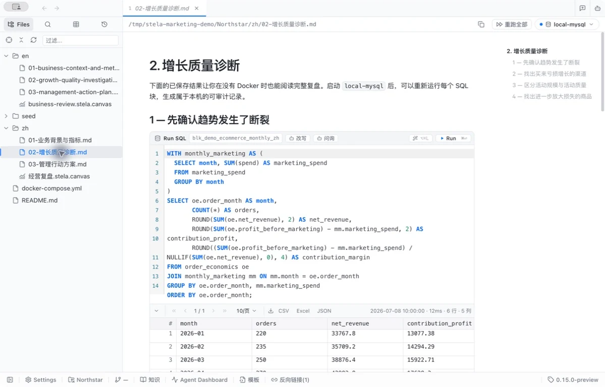
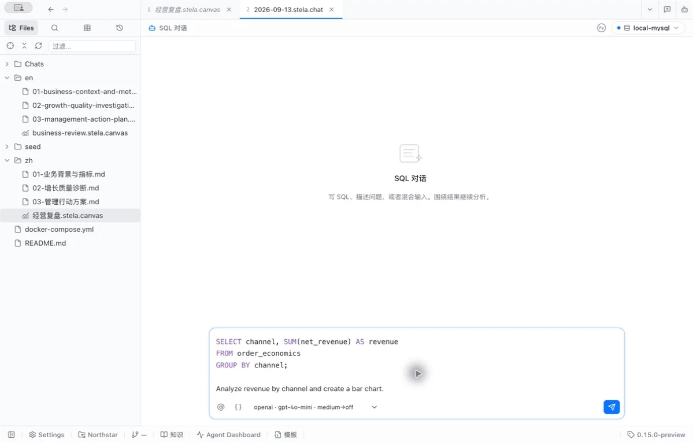
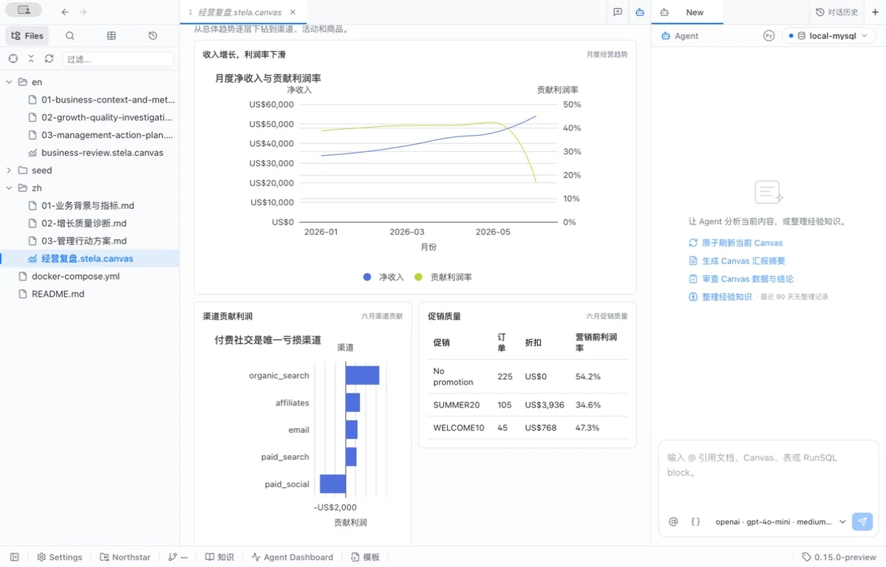
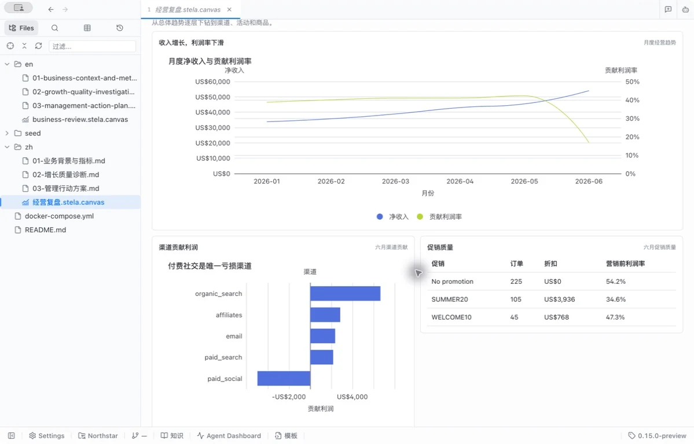
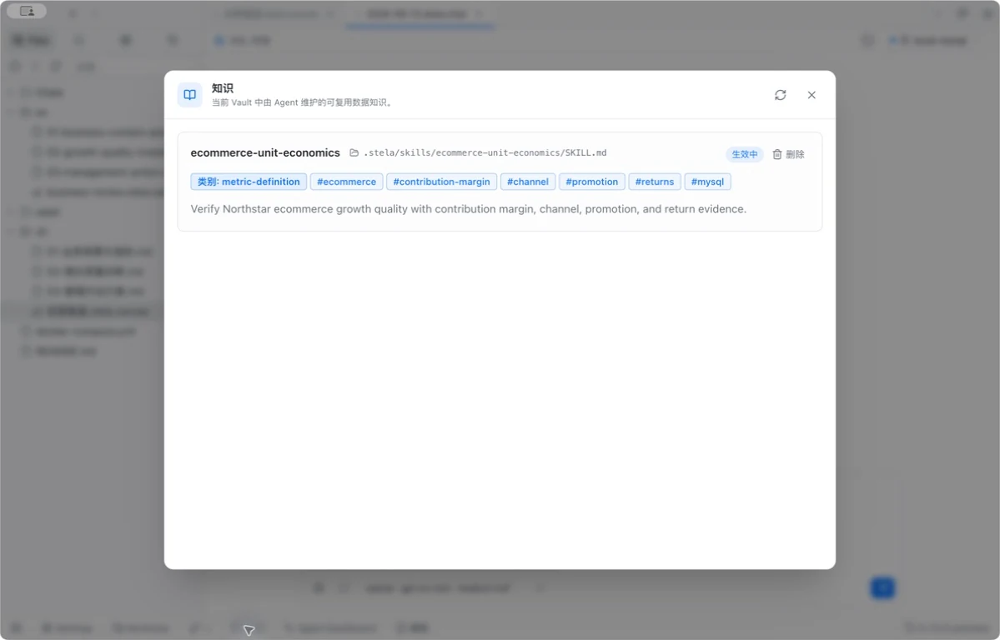
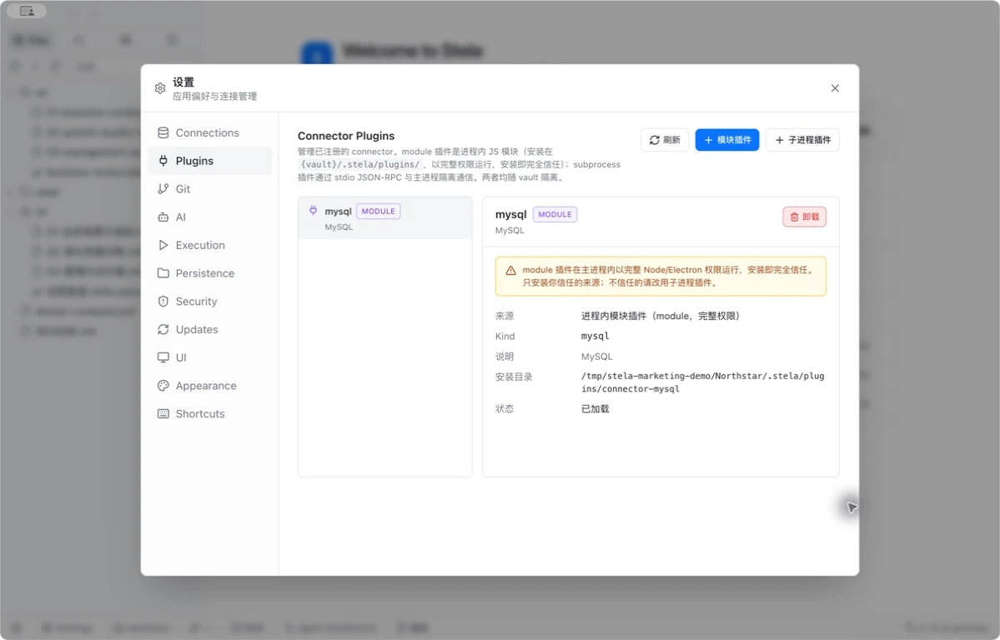

# Stela product screenshots

Real desktop captures. Click an image for its original PNG. See [provenance](./capture-manifest.md).

## SQL in Markdown

## SQL in Chat

## Data Agent

## Canvas

## Notes & automatic knowledge maintenance

## Database connector plugins

## Local-first

