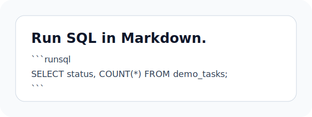

# Markdown Syntax Showcase

This note demonstrates common Markdown and GitHub Flavored Markdown syntax in
Stela. It is plain Markdown, so it should also remain readable in GitHub, VS
Code, Obsidian, and other Markdown tools.

## Headings

# Heading 1

## Heading 2

### Heading 3

#### Heading 4

##### Heading 5

###### Heading 6

## Paragraphs and Line Breaks

Markdown paragraphs are separated by blank lines. This paragraph contains a
soft line break in the source, but it should still render as one paragraph.

Add two trailing spaces before a newline to force a line break.\
This sentence should start on a new line.

## Emphasis

Use **bold**, *italic*, ***bold italic***, ~~strikethrough~~, `inline code`,
and normal text together in the same paragraph.

## Lists

Unordered list:

* Notes stay as `.md` files.

* RunSQL blocks live beside regular prose.

* Execution history can be synced with Git.

Ordered list:

1. Open a vault.
2. Choose a database connection.
3. Run a SQL block.
4. Compare results over time.

Nested list:

* Analysis

  * Assumptions

  * Queries

  * Results

* Publishing

  * Export Markdown

  * Commit notes

Task list:

* [x] Write a Markdown note.

* [x] Run a query.

* [ ] Add screenshots to the README.

## Blockquotes

> Good data notes keep context close to the query.
>
> * What question are we answering?
>
> * Which data source did we use?
>
> * When was the result produced?

## Links and Wiki Links

External link: [GitHub](https://github.com/)

Relative link: [MySQL demo](./mysql-demo.md)

Wiki-style link: \[\[notes/mysql-demo]]

## Images

Standard Markdown image syntax:



## Code Blocks

Inline SQL: `SELECT COUNT(*) FROM demo_tasks;`

Fenced JavaScript:

```js
const rows = [
  { status: "open", total: 2 },
  { status: "done", total: 4 },
];

console.table(rows);
```

Fenced SQL:

```sql
SELECT status, COUNT(*) AS total
FROM demo_tasks
GROUP BY status
ORDER BY status;
```

RunSQL block:

```runsql
SELECT status, COUNT(*) AS total
FROM demo_tasks
GROUP BY status
ORDER BY status;
```

## Tables

| Feature | Markdown source | Local cache | Git friendly |
| ------- | --------------- | ----------- | ------------ |
| Notes   | `.md`           | No          | Yes          |
| Results | detail summary  | Yes         | Optional     |
| History | JSONL           | Rebuildable | Yes          |

Aligned table:

| Column       |    Type   |  Description |
| :----------- | :-------: | -----------: |
| `id`         |  integer  |  Primary key |
| `status`     |    text   |   Task state |
| `created_at` | timestamp | Created time |

## Horizontal Rule

Above the rule.

***

Below the rule.

## Escaping Characters

Use a backslash to show literal Markdown markers:

\*not italic\*

\[not a link]\(<https://example.com>)

\`not inline code\`

## Checklist for Rendering

* Headings should create clear sections.

* Lists should keep indentation.

* Tables should stay readable.

* Code fences should preserve language labels.

* RunSQL blocks should remain executable in Stela.
